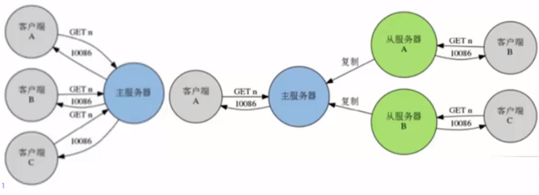

# Redis 集群
## 主从复制  Replication
- 一个redis服务可以有多个该服务器的复制品，这个redis服务称为Master，其他复制品称为Slaves
- 只要网络连接正常，Master会一直将自己的数据更新同步给Slaves，保持主从同步
- 只有Master可以执行写命令，Slaves只能执行读命令

从服务器分担了读的压力。
- 从服务器执行客户端发送的读命令，比如GET、LRANGE、SMEMMBERS、HGET、ZRANGE等等
- 客户端可以连接Slaves执行读请求，来降低Master的读压力

### 主从的复制和创建
- redis-server --slaveof <master-ip> <master-port> , 配置当前服务称为某Redis服务的Slaves
  - eg： redis-server --port 6380 --slaveof 127.0.0.1 6379
- SLAVEOF host port 命令，将当前服务器状态从Master修改为别的服务器的Slave
  - redis -> SLAVEOF 192.168.1.1 6379 将服务器转为Slave
  - redis -> SLAVEOF ON ONE 将服务器重新恢复到Master，不会丢弃已同步数据
- 配置方式：  启动时，服务器读取配置文件，并自动成为自定服务器的从服务器
  - slaveof <masterip> <masterport>
  - slaveof 127.0.0.1 6379
