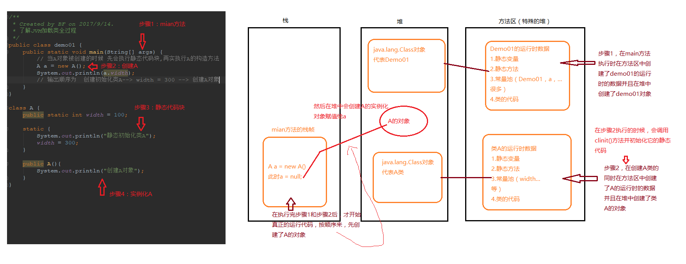

# JVM核心机制
## - 类加载过程
  * JVM把class文件加载到内存，并对数据进行校验，解析和初始化，最终形成JVM可以直接使用的JAVA类型的过程。
### 将Java类的二进制代码合并到JVM运行状态之中的过程
- 验证：确保加载的类信息符合JVM规范，没有安全方面的问题。  

* 准备：正式为类变量 `static` 变量分配内存并设置类变量初始值的阶段，这些内存都将在方法区中进行分配。

* 解析：虚拟机常量池内的符号引用替换为直接引用的过程。

```java
  所谓常量池的符号引用 例如创建一个新的类：
  public class MyClass {
      public static void main(String[] args) {
          String str = "abv";
          int i = 5;
      }
  }
  这里面的 `MyClass` `str`  `i` 都可以说是常量 存放于常量池中
```

### 初始化
  * 初始化阶段是执行类构造器 `clinit()` 方法的过程，类构造器`clinit()`方法是由编译器自动收集类中的所有类变量的赋值动作和静态语句块`static`块中的语句并合并产生的。

    > <font color=red>`clinit()`方法平时我们是看不到的,而且也不能自己去定义它</font>
  * 当初始化一个类的时候，如果发现其父类还没有进行初始化、则需要先出发其父类的初始化。
  * 虚拟机会保证一个类的`clinit()`方法在多线程环境中被正确的加锁和同步。

    >当一个类被初始化的时候肯定是线程安全的
  * 当访问一个Java类静态域的时候，只有真正声明这个域的类才会被初始化。

    >例图

    

    >代码
    >````java
    >/**
    >* Created by BF on 2017/9/14.
    > * 了解JVM加载类全过程
    > */
    >public class demo01 {
    >    public static void main(String[] args) {
    >        // 当A对象被创建的时候 先会执行静态代码块,再实执行A的构造方法
    >        A a = new A();
    >        System.out.println(a.width);
    >        // 输出顺序为  创建初始化类A--> width = 300 --> 创建A对象
    >    }
    >}
    >class A {
    >    public static int width = 100;
    >
    >    static {
    >        System.out.println("静态初始化类A");
    >        width = 300;
    >    }
    >    public A(){
    >        System.out.println("创建A对象");
    >    }
    >}
    >````

### 加载
  * 将class文件字节码内容加载到内存中，并将这些静态数据转换成方法 区中的运行时数据结构，在堆中生成一个代表这个类的java.lang.Class对象，作为方法区类数据的访问入口，<font color=red>这个过程需要类的加载器参与</font>。

  * 类加载全过程  --><font color=gray>重点理解</font>
    便于理解，先把代码贴出来
    ```java
    public class demo01 {
      public static void main(String[] args) throws ClassNotFoundException {
        // 主动引用
        new A();
        System.out.println(A.width);
        Class.forName("com.wiceflow.JVM.A");
        // 被动引用
        System.out.println(A.MAX);
        A[] as = new A[10];
        System.out.println(B.width);
      }
    }
    
    class A extends A_Father{
      public static int width = 100;
      public static final int MAX = 200;
      static {
        System.out.println("静态初始化类A");
        width = 300;
      }
    
      public A(){
        System.out.println("创建A对象");
      }
    }
    class A_Father{
      static {
        System.out.println("静态初始化A的父类");
      }
    }
    class B extends A{
      static {
        System.out.println("静态初始化类B");
      }
    }
    new A() 正常打印结果：
      静态初始化A的父类
      静态初始化类A
      创建A对象
    ```

      * 类的主动引用（一定会发生类的初始化）
        * new 一个类的对象

          >当new一个类的新对象,类必然会初始化 eg：`new A()`

        * 调用类的静态成员（除了final常量）和静态方法

          >eg：上述类A中有静态成员 `width` 当在其他类中调用到 `A.width`，类A一定会初始化

        * 使用java.lang.reflect包的方法对类进行反射调用

          >放射调用该类必会导致该类初始化，否则反射调用不会成功 eg: `Class.forName("com.wiceflow.JVM.A")`

        * 当虚拟机启动，java Hello，则一定会初始化Hello类，说白了就是启用Main方法所在的类
        * 当初始化一个类，如果其父类没有被初始化，则会先初始化其父类

          >由上述代码可以看出 `A`类继承`A_Father`类，当`A`类初始化的时候，因为其继承了`A_Father`，所以会先初始化`A_Father`类，而每个类都会继承`Object`类，所以这个类一定会被初始化

      * 类的被动引用（不会发生类的初始化）
        * 当访问一个静态域时，只有真正声明这个域的类才会被初始化
          * <font color=“”>通过子类引用父类的静态变量，不会导致子类初始化</font>
          >例如上面类`B`继承了类`A`，当`B`中调用`B.width`的时候，由于类`B`本身没有`width`变量，所以是取自其父类`A`，这时候虚拟机初始化的是类`A`，而类`B`并不会被初始化

        * 引用常量不会触发此类的初始化（常量在编译阶段就存入调用类的常量池中了）
        >eg:在`A`中定义了一个`final`常量`MAX`，这个常量在编译的时候就会创建并存储在方法区(特殊的堆)中，这时候调用只是在方法区将其取出，并不会涉及类`A`的初始化