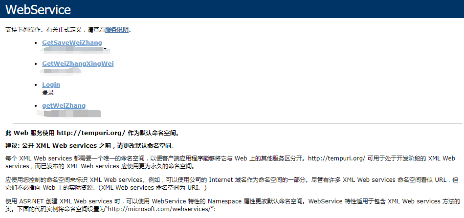

# Java 利用 WebService 接C#接口数据  

最近项目需要接别的平台的数据，而且其他平台给的是 `.asmx` 后缀的 web 服务文件。写这篇文章来记录遇到的问题以及解决方法。  


## .asmx 是什么  

简单来说，.asmx 是 web 服务文件，利用 soap 方式 http 访问，用 xml 返回，可以返回基础类型和PUBLIC结构类型。来看一下 webService 的页面  



我这篇文章题目写的是 **Java 利用 webService 接 C# 的数据** ，其实不管是 Java 还是 C# 都可以生成 webService 文件。  

## 在 Java 中摆平 webService  

Java 处理 .asmx 格式的 webService 服务文件有多种方式，大致的提一下他们，一种是利用工具将 webService 转成对应的 Java 代码，然后运行就可以了，另外一种也是接下来我要讲的，利用 apache 的 axis 来处理。  


### axis 处理 webService  

先来看代码  这是一个枯燥且无趣的过程  

```java
public void accidentWebServiceTest() throws RemoteException, MalformedURLException, ServiceException {
        // 指出service所在完整的URL
        String endpoint = "http://ip/WebService.asmx?op=Login";
        //调用接口的 包名
        String targetNamespace = "http://page/";
        //所调用接口的方法method
        String method = "Login";
        // 创建一个服务(service)调用(call)
        Service service = new Service();
        // 通过service创建call对象
        Call call = (Call) service.createCall();
        // 设置service所在URL
        call.setTargetEndpointAddress(new java.net.URL(endpoint));
        call.setOperationName(new QName(targetNamespace, method));
        call.setUseSOAPAction(true);
        // 变量最好只是用String类型，其他类型会报错  设置参数名 state  第二个参数表示String类型,第三个参数表示入参
        call.addParameter(new QName(targetNamespace, "sUser"), org.apache.axis.encoding.XMLType.XSD_STRING, javax.xml.rpc.ParameterMode.IN);
        call.addParameter(new QName(targetNamespace, "sPass"), org.apache.axis.encoding.XMLType.XSD_STRING, javax.xml.rpc.ParameterMode.IN);
        // 设置返回类型
        call.setReturnType(XMLType.SOAP_STRING);
        // 设置 http 头部 默认用包名加方法
        call.setSOAPActionURI(targetNamespace + method);
        // 参数  
        String[] params = new String[2];
        params[0] = "test";
        params[1] = "test";
        // params[2] = "";
        String jsonString = (String) call.invoke(params);
        Map<String,String> sss = call.getOutputParams();
        System.out.println(jsonString);
        Collection<String> set = sss.values();
        for(String s : set){
            System.out.println(s);
        }
    }
```


我们可以看到，这是一个很简单的调用过程，内部原理 apache 都已经做好了。  

我们可以看到，call 调用了 addParameter 方法来添加执行参数，一定是要需要接的接口有什么参数就写什么。而且当出现多个参数时，调用多次 addParameter  方法。（这里不能链式编程）  

当我们使用了多少次 addParameter  方法后，后面的执行方法传参也必须传相同的格式。  

`call.invoke(params)`  若是无参的时候，这里要传一个空的数组 `new Object[]`  ，其返回的 Object 对象便是接口方法的返回值。  

### 一个很大的坑  

在 C# 中，它的 API 返回函数不止可以定义在返回值中，还可以定义在参数中，来看一下下面的代码。  

```c#
Public int getWeiZhang(string param1,string param2, out string sParam);
```

可以看到，这里默认返回的是一个 int 类型的数据，那么我们在上面 `call.invoke(params);` 接收的就是这个值。可是我们看参数列表，还有一个 `out String sparam` 这个其实也是一个返回值，前面的 `int` 返回类型是为了确实运行状态，而可以额外返回一个 String 类型。

例如我需要返回用户登录成功后的 token 还要返回登录状态，在 Java 中我们可以定义 DTO 来返回，那么在 C# 中这种格式也是被默许的。  

问题出现在这里，`call.invoke(params);` 返回的是方法的返回值，那么在参数中定义的 `out` 返回如何接收？  

看下面的一条语句  `Map<String,String> sss = call.getOutputParams();` 这个便是接收 out 的返回数据，相当于接收了 API 的输出流。必须要用 Map 来接收参数，其 key 为上面定义的 `QName` 值。

