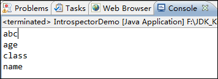
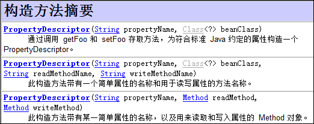

# 内省之Introspector、BeanInfo、PropertyDescriptor    

转载自：https://www.cnblogs.com/fjdingsd/p/5272113.html

​        内省`Introspector`是专门用来操作JavaBean属性的。不是所有的字段`Field`都能被称之为属性，只有某些字段具有`getXXX`或`setXXX`方法的才能称之为属性，当然要称为是一个`Bean`还需要有一个无参的构造器，而内省就是对这些属性进行操作。    

我们先来看一个例子来数一数Javabean的属性：  

```java
public class Person {
    private String name;
    private int age;
    
    public String getName() {
        return name;
    }
    public void setName(String name) {
        this.name = name;
    }
    public int getAge() {
        return age;
    }
    public void setAge(int age) {
        this.age = age;
    }
    
    public String getAbc() {
        return null;
    }
}
```

​	这里面一共有多少属性呢？  

　　答案是4个，除了两个私有字段提供了`get`或`set` 方法成为了这个类的属性之外，还有外加的一个`getXXX`(那么属性为`xXX`)，最后还有一个从`Object`类中继承的`getClass`方法(属性为class)，所以`Person`中含有4个属性。

　　回归到内省，当然仅仅操作是属性，可以按操作字段一样采用反射，但是采用内省会更加专业。

　　在JavaAPI中有专门的一个类封装了内省的操作，这个类就是`Introspector`类，通过`getBeanInfo(…)`方法就可以将某个类中的属性封装到一个`BeanInfo`类中。

　　取得`BeanInfo`对象后就相当于取得某个类的所有属性，那么再调用`BeanInfo`对象中的`getPropertyDescriptors()`方法获得`PropertyDescriptor[]`数组对象，每个数组中的元素都是`PropertyDescriptor`实例(属性描述器)，而`PropertyDescriptor`实例封装了每个属性特有的一些性质，比如调用`getReadMethod()`方法就能获得这个属性的`get方法Method`，调用`getWriteMethod()`方法就能获得这个属性的`set`方法`Method`。  

通过一段简单的代码来测试一下刚才`Person`这个`bean`对象到底有多少个属性：  

```java
Person p = new Person();
BeanInfo beanInfo = Introspector.getBeanInfo(p.getClass());
PropertyDescriptor[] pds = beanInfo.getPropertyDescriptors();
for(PropertyDescriptor pd:pds) {
     System.out.println(pd.getName());
}
```

控制台观察：  



可以看到确实是有4个属性。  

​	如果我们不想有父类继承的某些`get`或`set`方法而继承下来的属性，比如上述的`class`，那么我们在最开始使用`Introspector. getBeanInfo`时可以使用对应的参数列表：  


当然这个方法也可以不需要某一级以上的父类属性，非常灵活。  

如果想直接操作一个`bean`的某个具体属性，那么其实我们可以直接使用属性描述器`PropertyDescriptor`的构造函数：  



比如我想操作上述`Person`类的`age`属性：  

```java
PropertyDescriptor pd = new PropertyDescriptor("age", Person.class);
Person p = new Person();
Method setAgeMethod = pd.getWriteMethod();
setAgeMethod.invoke(p,25);
Method getAgeMethod = pd.getReadMethod();
System.out.println(getAgeMethod.invoke(p, null));
```

输出：25  

当然，获得某个属性的属性描述器`PropertyDescriptor`，调用`getPropertyType`方法还能知道该属性的类型：  

```java
PropertyDescriptor pd = new PropertyDescriptor("age", Person.class);
System.out.println(pd.getPropertyType()); 
```

输出：  `int  `

