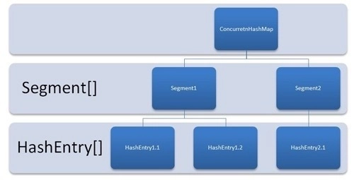
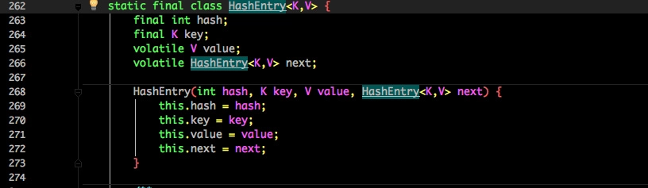
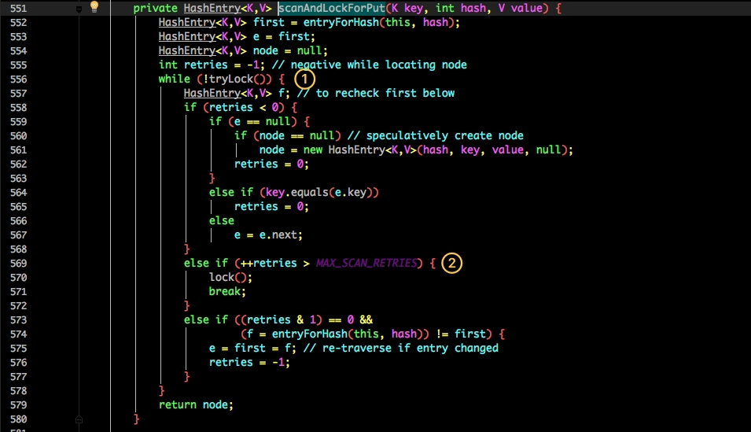
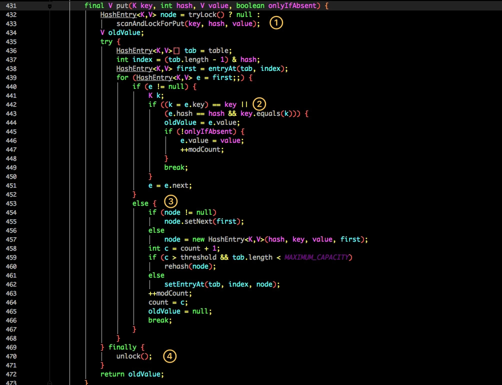
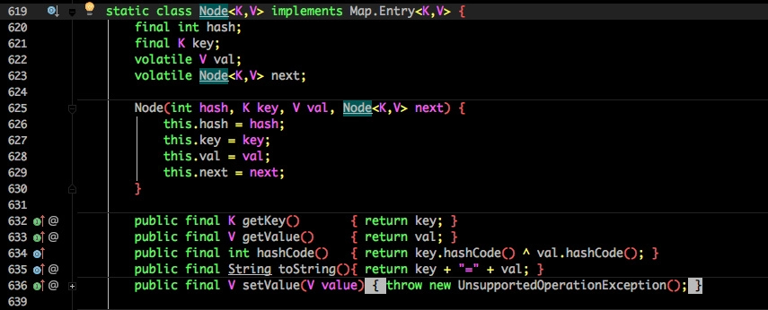
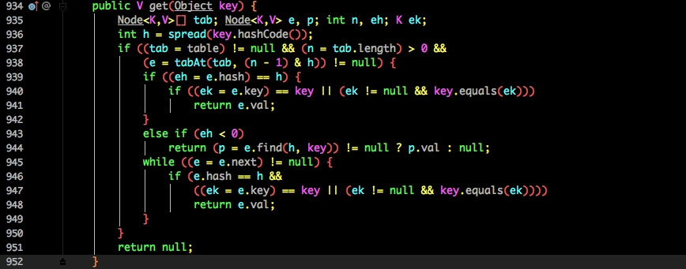

# ConcurrentHashMap 简单看看？  

因为懒。。[网上看到一篇不错的](https://crossoverjie.top/2018/07/23/java-senior/ConcurrentHashMap/#comments)，摘抄下来了，通过结合前两篇的 `HashMap` 源码解析，可以了解它的一个过程，在面试中也能回答个八九不离十  

`ConcurrentHashMap` 同样也分为 1.7 、1.8 版，两者在实现上略有不同。


### 1.7 的 ConcurrentHashMap  

先来看看 1.7 的实现，下面是他的结构图：  

  

如图所示，是由 `Segment`  数组、`HashEntry` 组成，和 `HashMap` 一样，仍然是数组加链表。  

它的核心成员变量：  

```java
/**
 * Segment 数组，存放数据时首先需要定位到具体的 Segment 中。
 */
final Segment<K,V>[] segments;
transient Set<K> keySet;
transient Set<Map.Entry<K,V>> entrySet;
```

`Segment`  是  `ConcurrentHashMap`  的一个内部类，主要的组成如下：  

```java
   static final class Segment<K,V> extends ReentrantLock implements Serializable {
       private static final long serialVersionUID = 2249069246763182397L;
       
       // 和 HashMap 中的 HashEntry 作用一样，真正存放数据的桶
       transient volatile HashEntry<K,V>[] table;
       transient int count;
       transient int modCount;
       transient int threshold;
       final float loadFactor;  
   }
```

看看其中` HashEntry `的组成：  



和 `HashMap` 非常类似，唯一的区别就是其中的核心数据如 `value` ，以及链表都是 `volatile` 修饰的，保证了获取时的可见性。

原理上来说：`ConcurrentHashMap` 采用了分段锁技术，其中 `Segment` 继承于 `ReentrantLock`。不会像 `HashTable` 那样不管是 put 还是 get 操作都需要做同步处理，理论上 `ConcurrentHashMap` 支持  `CurrencyLevel` (`Segment`  数组数量)的线程并发。每当一个线程占用锁访问一个 `Segment`  时，不会影响到其他的  `Segment`。

下面也来看看核心的 `put get` 方法。

**重要的还是 put 方法**

```java
public V put(K key, V value) {
    Segment<K,V> s;
    if (value == null)
        throw new NullPointerException();
    int hash = hash(key);
    int j = (hash >>> segmentShift) & segmentMask;
    if ((s = (Segment<K,V>)UNSAFE.getObject          // nonvolatile; recheck
         (segments, (j << SSHIFT) + SBASE)) == null) //  in ensureSegment
        s = ensureSegment(j);
    return s.put(key, hash, value, false);
}
```

首先是通过 `key` 定位到 `Segment`，之后在对应的 `Segment` 中进行具体的 `put`。

```java
final V put(K key, int hash, V value, boolean onlyIfAbsent) {
    HashEntry<K,V> node = tryLock() ? null :
        scanAndLockForPut(key, hash, value);
    V oldValue;
    try {
        HashEntry<K,V>[] tab = table;
        int index = (tab.length - 1) & hash;
        HashEntry<K,V> first = entryAt(tab, index);
        for (HashEntry<K,V> e = first;;) {
            if (e != null) {
                K k;
                if ((k = e.key) == key ||
                    (e.hash == hash && key.equals(k))) {
                    oldValue = e.value;
                    if (!onlyIfAbsent) {
                        e.value = value;
                        ++modCount;
                    }
                    break;
                }
                e = e.next;
            }
            else {
                if (node != null)
                    node.setNext(first);
                else
                    node = new HashEntry<K,V>(hash, key, value, first);
                int c = count + 1;
                if (c > threshold && tab.length < MAXIMUM_CAPACITY)
                    rehash(node);
                else
                    setEntryAt(tab, index, node);
                ++modCount;
                count = c;
                oldValue = null;
                break;
            }
        }
    } finally {
        unlock();
    }
    return oldValue;
}
```

虽然 `HashEntry` 中的 `value` 是用 `volatile` 关键词修饰的，但是并不能保证并发的原子性，所以 `put` 操作时仍然需要加锁处理。

首先第一步的时候会尝试获取锁，如果获取失败肯定就有其他线程存在竞争，则利用 `scanAndLockForPut()` 自旋获取锁。



1. 尝试自旋获取锁。
2. 如果重试的次数达到了 `MAX_SCAN_RETRIES` 则改为阻塞锁获取，保证能获取成功。  



再结合图看看 put 的流程。

1. 将当前 `Segment` 中的 `table` 通过 `key` 的 `hashcode` 定位到 `HashEntry`。
2. 遍历该 `HashEntry`，如果不为空则判断传入的 `key` 和当前遍历的 `key` 是否相等，相等则覆盖旧的 `value`。
3. 不为空则需要新建一个 `HashEntry` 并加入到 `Segment` 中，同时会先判断是否需要扩容。
4. 最后会解除在 1 中所获取当前 `Segment` 的锁。  

put 方法的几个重点都讲完了，总体结构和 `HashMap`差不多，1.7的 `ConcurrentHashMap` 采用了 `segment` 加分段锁的来确保并发

**接下来到 get 方法哦**  

```java
public V get(Object key) {
    Segment<K,V> s; // manually integrate access methods to reduce overhead
    HashEntry<K,V>[] tab;
    int h = hash(key);
    long u = (((h >>> segmentShift) & segmentMask) << SSHIFT) + SBASE;
    if ((s = (Segment<K,V>)UNSAFE.getObjectVolatile(segments, u)) != null &&
        (tab = s.table) != null) {
        for (HashEntry<K,V> e = (HashEntry<K,V>) UNSAFE.getObjectVolatile
                 (tab, ((long)(((tab.length - 1) & h)) << TSHIFT) + TBASE);
             e != null; e = e.next) {
            K k;
            if ((k = e.key) == key || (e.hash == h && key.equals(k)))
                return e.value;
        }
    }
    return null;
}
```

get 逻辑比较简单：

只需要将 `Key` 通过 `Hash` 之后定位到具体的 `Segment` ，再通过一次 `Hash` 定位到具体的元素上。

由于 `HashEntry` 中的 `value` 属性是用 `volatile` 关键词修饰的，保证了内存可见性，所以每次获取时都是最新值。

`ConcurrentHashMap` 的 get 方法是非常高效的，**因为整个过程都不需要加锁**。（比 `HashTable` 要快很多）  

### 1.8 的 ConcurrentHashMap

1.8 里面的 `ConcurrentHashMap` 又升级啦，看 `HashMap` 源码可以知道，1.8 和 1.7 的对比是 1.8 中加入了红黑树结构，那么在 `ConcurrentHashMap` 中，也是采用了链表 + 红黑树的结构来确保效率，并且摒弃了 1.7 中的 `segment` + 分段锁，采用 `CAS` 和 `synchronized` 来解决并发问题。   

> CAS `compareAndSet` 比较并写入

1.8 中的哈希桶结构如下：  



将 1.7 中存放数据的 `HashEntry `改为 Node，但作用都是相同的。

其中的 `val next` 都用了 volatile 修饰，保证了可见性。

**put 方法**


解析一下步骤啦：

- 根据 key 计算出 `hashcode` 。
- 判断是否需要进行初始化。
- `f` 即为当前 `key` 定位出的 `Node`，如果为空表示当前位置可以写入数据，利用 CAS 尝试写入，失败则自旋保证成功。
- 如果当前位置的 ``hashcode == MOVED == -1``,则需要进行扩容。
- 如果都不满足，则利用 `synchronized` 锁写入数据。
- 如果数量大于 ``TREEIFY_THRESHOLD`` 则要转换为红黑树。  

简单的介绍完 put 方法，其实都是差不多的，里面的细节 `CAS` 推荐大家另外去理解  

**get 方法**



- 根据计算出来的 `HashCode` 寻址，如果就在桶上那么直接返回值。
- 如果是红黑树那就按照树的方式获取值。
- 就不满足那就按照链表的方式遍历获取值。  

我们来对比一下 1.7 和 1.8 的改变  

1.8 在 1.7 的数据结构上做了大的改动，采用红黑树之后可以保证查询效率（`O(logn)`），甚至取消了 `ReentrantLock` 改为了 `synchronized`，这样可以看出在新版的 JDK 中对 synchronized 优化是很到位的。