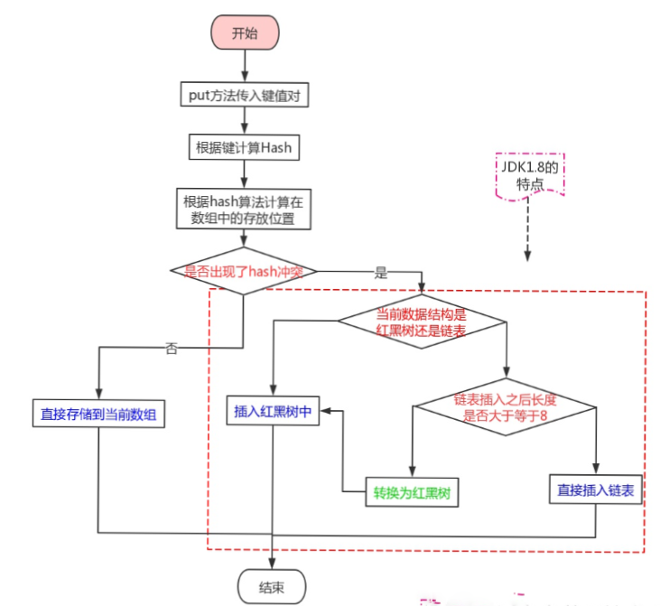
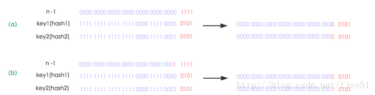
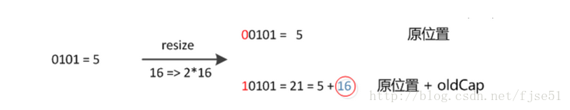
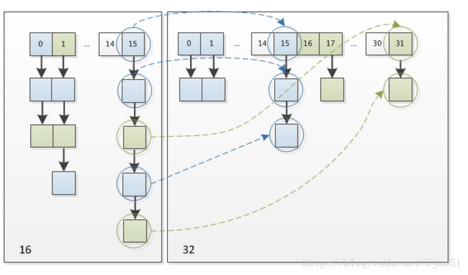

# HashMap 1.8 源码解析  

看这一篇之前建议先看 `HashMap 1.7源码解析` ，本文接着上文讲，可能一些基本的不会涉及到  

简单提及一下 1.7 和 1.8 对于 `HashMap` 的数据结构  

> 1.7 -> 内部是一个 Entry<>[] 数组，实际上是由数组 + 链表组成的 
>
> 1.8 -> 内部是一个 Node[] 类似于 Entry<>[] 数组的结构，实际上是由数组 + 链表 a


### HashMap 在 1.8 中优化了啥？  

查看 1.7 的源码，可以发现当越来越多的 `Hash`冲突时，会导致链表越来越长。我们知道数组的查询速度是 O(1)，而链表的查询速度是 O(n)，所以当链表越来越长的时候，对应的查询效率也会越来越低。1.8 中主要优化的是 `HashMap` 的扩容机制  

扩容机制包括了两点  

* 扩容时，若链表大于默认值 8，则将对应位置的默认链表转换成红黑树  
* 扩容时，判断 `Hash` 值得变化（不需要重新计算）  

### 源码源码  

先来看看 1.8 中的几个常量  

```java
    //默认数组容量大小：16
    static final int DEFAULT_INITIAL_CAPACITY = 1 << 4; 
    
    //数组最大容量大小：2 的 30 次方
    static final int MAXIMUM_CAPACITY = 1 << 30;
    
    //默认的加载因子
    static final float DEFAULT_LOAD_FACTOR = 0.75f;

    //使用树而不是链表的计数阈值，将元素添加到至少这么多的节点的链表中时，链表将转换为树
    static final int TREEIFY_THRESHOLD = 8;
    
    //可以进行树化的最小数组容量
    static final int MIN_TREEIFY_CAPACITY = 64;
    
    //存储键值对元素的数组，分配后，长度始终是 2 的幂（哈希桶数组）
    transient Node<K,V>[] table;
    
    //此映射中包含的键-值映射数，即当前数组中的元素数量
    transient int size;
    
    //主要用于记录HashMap内部结构发生变化的次数。
    transient int modCount;
    
    //哈希表所能容纳的最大键值对个数，下次扩容的临界值，size>=threshold 数组就会扩容
    int threshold;
    
    //负载因子
    final float loadFactor;
```

我们初始化 `HashMap` 的时候可以设置负载因子 `loadFactor` 的大小，当使用默认的时候负载因子就是 `0.75f`。  

那第一次引起 `HashMap` 扩容的大小`threshold * loadFactor = 12`

#### 来聊聊这个负载因子  

由上面公式可以看出，`HashMap` 的容量大小与这个负载因子有着很大的关系，当这个负载因子设置的很大的时候，`HashMap` 扩容的次数就会减少（扩容次数少了，最终结果是 `HashMap` 的容量不会很大），此时散列表的装填效率就会越高，也就是能容纳更多的元素，而元素多了，链表就会对应的增大，所以此时的索引效率就会降低。反之，如果负载因子过小，可能导致 `HashMap` 进行更多次的扩容，那么 `HashMap` 容量大小实际上会比用上的大（因为每次扩容都是幂次方进行扩容），此时会导致链表中的数据量稀疏，就会造成空间上的浪费，不过此时索引效率高。所以设置一个合理的负载因子很重要，具体要看业务场景实际操作。  


#### 1.8 确定哈希数组的位置  

`HashMap` 中是根据 `Key` 的哈希值来确定键值对在哈希桶数组中的位置的。  

来看看 `hash()` 方法  

```java
    // 经过两步操作最后得到的才是我们用来确定位置的hash值
    static final int hash(Object key) {
        int h;
        // h = key.hashCode() 为第一步 取hashCode值
        // h ^ (h >>> 16)  为第二步 高位参与运算
        return (key == null) ? 0 : (h = key.hashCode()) ^ (h >>> 16);
    }
    // 确定hash值之后的操作就是确定在哈希桶中的位置了
    // 下面是 put() 方法中的一行代码，n为哈希桶数组长度，hash为前一步确定的hash值
    p = tab[i = (n - 1) & hash]
```

可以看到，在 1.8 中，哈希桶数组的索引位置是由位运算来操作的，下面引用知乎大佬的一个列子[Java 8系列之重新认识HashMap](https://zhuanlan.zhihu.com/p/21673805)  

​                                

在 1.8 的实现中，优化了高位运算的算法，通过hashCode()的高16位异或低16位实现的：`(h = k.hashCode()) ^ (h >>> 16)`，主要是从速度、功效、质量来考虑的，这么做可以在数组table的length比较小的时候，也能保证考虑到高低Bit都参与到Hash的计算中，同时不会有太大的开销。 


#### put 方法，扩容时发生在 put 中的

```java
final V putVal(int hash, K key, V value, boolean onlyIfAbsent,
                   boolean evict) {
		// 判断table是否为空，如果是空的就创建一个table，并获取他的长度
        Node<K,V>[] tab; Node<K,V> p; int n, i;
        if ((tab = table) == null || (n = tab.length) == 0)
            n = (tab = resize()).length;
		// 如果计算出来的索引位置之前没有放过数据，就直接放入
        if ((p = tab[i = (n - 1) & hash]) == null)
            tab[i] = newNode(hash, key, value, null);
        else {
			// 进入这里说明索引位置已经放入过数据了
            Node<K,V> e; K k;
			// 判断put的数据和之前的数据是否重复
            if (p.hash == hash &&
                ((k = p.key) == key || (key != null && key.equals(k))))   
                // key的地址或key的equals()只要有一个相等就认为key重复了，就直接覆盖原来key的value
                e = p;
			// 判断是否是红黑树，如果是红黑树就直接插入树中
            else if (p instanceof TreeNode)
                e = ((TreeNode<K,V>)p).putTreeVal(this, tab, hash, key, value);
            else {
				// 如果不是红黑树，就遍历每个节点，判断链表长度是否大于8，如果大于就转换为红黑树
                for (int binCount = 0; ; ++binCount) {
                    if ((e = p.next) == null) {
                        p.next = newNode(hash, key, value, null);
                        if (binCount >= TREEIFY_THRESHOLD - 1) // -1 for 1st
                            treeifyBin(tab, hash);
                        break;
                    }
					// 判断索引每个元素的key是否可要插入的key相同，如果相同就直接覆盖
                    if (e.hash == hash &&
                        ((k = e.key) == key || (key != null && key.equals(k))))
                        break;
                    p = e;
                }
            }
			// 如果e不是null，说明没有迭代到最后就跳出了循环，说明链表中有相同的key，因此只需要将value覆盖，并将oldValue返回即可
            if (e != null) { // existing mapping for key
                V oldValue = e.value;
                if (!onlyIfAbsent || oldValue == null)
                    e.value = value;
                afterNodeAccess(e);
                return oldValue;
            }
        }
		// 说明没有key相同，因此要插入一个key-value，并记录内部结构变化次数
        ++modCount;
        // 插入数据后，若数组容量大于扩容触发条件
        if (++size > threshold)
            resize();
        afterNodeInsertion(evict);
        return null;
    }
```

思路如下：

* 判断table[]是否为空

* 判断table[i]处是否插入过值

* 判断链表长度是否大于8，如果大于就转换为红黑二叉树，并插入树中

* 判断key是否和原有key相同，如果相同就覆盖原有key的value，并返回原有value

* 如果key不相同，就插入一个key，记录结构变化一次
* 判断是否需要扩容  

来一张流程图看看  

   


我们的`HashMap` 扩容就发生在 `put`  过程中，可以看到，当产生哈希冲突的时候，`value` 会形成一条链表，而在 1.8 中，当链表的长度大于8的时候，链表就会转换为红黑树，此时这一个哈希桶的查询效率就变成了 O(logn)    

**上面讲到了扩容时 1.8 引入了红黑树，这是其中一个改进，还在一个改进是啥？**  

还有一个改进我们上面也已经说了，就是 `Hash` 值得计算。  

继续用图来解释一下  [HashMap JDK1.8实现原理](https://www.cnblogs.com/duodushuduokanbao/p/9492952.html)

  

我们使用的是2次幂的扩展(指长度扩为原来2倍)，所以，元素的位置要么是在原位置，要么是在原位置再移动2次幂的位置。看上图可以明白这句话的意思，n 为 table 的长度，图（a）表示扩容前的 `key1` 和 `key2` 两种 `key` 确定索引位置的示例，图（b）表示扩容后 `key1` 和 `key2` 两种 `key` 确定索引位置的示例，其中 `hash1` 是 `key1` 对应的哈希与高位运算结果。  

元素在重新计算 hash 之后，因为 n 变为 2 倍，那么 n-1 的 mask 范围在高位多 1 bit (红色)，因此新的 index 就会发生这样的变化：  



因此，我们在扩充 `HashMap` 的时候，不需要像 1.7 的实现那样重新计算 `hash`，只需要看看原来的 `hash` 值新增的那个 `bit` 是1还是0就好了，是0的话索引没变，是1的话索引变成 `“原索引+oldCap”`，可以看看下图为16扩充为32的 `resize` 示意图：



这个设计确实非常的巧妙，既省去了重新计算 `hash` 值的时间，而且同时，由于新增的1bit是0还是1可以认为是随机的，因此 `resize` 的过程，均匀的把之前的冲突的节点分散到新的 `bucket` 了。这一块就是 1.8 新增的优化点。有一点注意区别，1.7 中 `rehash` 的时候，旧链表迁移新链表的时候，如果在新表的数组索引位置相同，则链表元素会倒置，但是从上图可以看出 1.8不会倒置。  

### get 方法，简单提及一下  

get 方法没有啥特别的，就是在 `get` 数据的时候，先判断哈希桶的位置上是链表还是红黑树，再根据不同的形式去获取对应的值。  

有一点稍微注意的是，哈希数组中的第一位存的是 `key = null` 的值，当 `key`  为空的时候，默认直接返回对应的值  

```java
	final Node<K,V> getNode(int hash, Object key) {
        Node<K,V>[] tab; Node<K,V> first, e; int n; K k;
		// 如果表不是空的，并且要查找索引处有值，就判断位于第一个的key是否是要查找的key
        if ((tab = table) != null && (n = tab.length) > 0 &&
            (first = tab[(n - 1) & hash]) != null) {
            if (first.hash == hash && // always check first node
                ((k = first.key) == key || (key != null && key.equals(k))))
				// 如果是，就直接返回
                return first;
			// 如果不是就判断链表是否是红黑二叉树，如果是，就从树中取值
            if ((e = first.next) != null) {
                if (first instanceof TreeNode)
                    return ((TreeNode<K,V>)first).getTreeNode(hash, key);
				// 如果不是树，就遍历链表
                do {
                    if (e.hash == hash &&
                        ((k = e.key) == key || (key != null && key.equals(k))))
                        return e;
                } while ((e = e.next) != null);
            }
        }
        return null;
    }
```

### 红黑树  

都说红黑树效率高，那是为什么呢？

> [答案在这里](www.baidu.com)  我了解的不是很清楚，只知道它是一个自平衡的二叉查找树  

**那在 `HashMap`  中不一开始就是用红黑树，而是要在链表长度大于 8 的时候才将链表转换为红黑树？**  

在这里可以从两方面来解释

（1）构造红黑树要比构造链表复杂，在链表的节点不多的时候，从整体的性能看来， 数组+链表+红黑树的结构可能不一定比数组+链表的结构性能高。就好比杀鸡焉用牛刀的意思。

（2）`HashMap` 频繁的扩容，会造成底部红黑树不断的进行拆分和重组，这是非常耗时的。因此，也就是链表长度比较长的时候转变成红黑树才会显著提高效率。  


完结~

