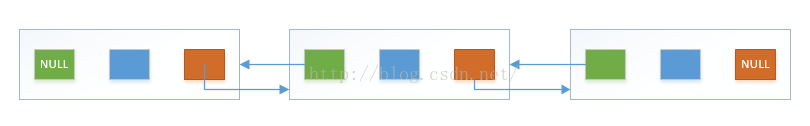
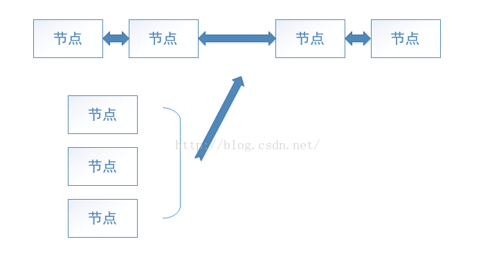
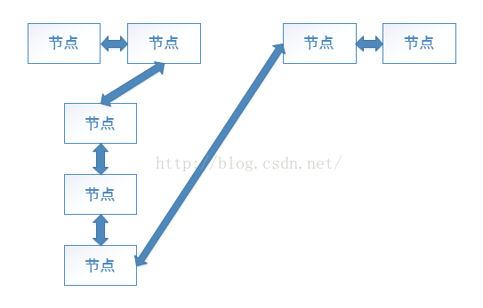

# LinkedList源码分析，基于JDK1.7及以上的
&nbsp;&nbsp;&nbsp;JDK1.7后LinkedList的的链表结构是直线链表，之前版本的是环型链表
&nbsp;&nbsp;&nbsp;LinkedList包含3个全局参数，size存放当前链表有多少个节点。first为指向链表的第一个节点的引用。last为指向链表的最后一个节点的引用。
## LinkedList的基本结构

&nbsp;&nbsp;&nbsp;在LinkedList中，我们把链子的“环”叫做“节点”，每个节点都是同样的结构。节点与节点之间相连，构成了我们LinkedList的基本数据结构，也是LinkedList的核心。
我们再来看一下LinkedList在jdk1.6和1.7直接结构的区别
首先看1.7中的结构


## LinkedList的构造方法
&nbsp;&nbsp;&nbsp;
inkedList构造方法有两个，一个是无参构造，一个是传入Collection对象的构造。
```java
    // 什么都没做，是一个空实现
    public LinkedList() {
    }
    public LinkedList(Collection<? extends E> c) {
        this();
        addAll(c);
    }
    public boolean addAll(Collection<? extends E> c) {
        return addAll(size, c);
    }
    public boolean addAll(int index, Collection<? extends E> c) {
        // 检查传入的索引值是否在合理范围内
        checkPositionIndex(index);
        // 将给定的Collection对象转为Object数组
        Object[] a = c.toArray();
        int numNew = a.length;
        // 数组为空的话，直接返回false
        if (numNew == 0)
            return false;
        // 数组不为空
        Node<E> pred, succ;
        if (index == size) {
            // 构造方法调用的时候，index = size = 0，进入这个条件。
            succ = null;
            pred = last;
        } else {
            // 链表非空时调用，node方法返回给定索引位置的节点对象
            succ = node(index);
            pred = succ.prev;
        }
        // 遍历数组，将数组的对象插入到节点中
        for (Object o : a) {
            @SuppressWarnings("unchecked") E e = (E) o;
            Node<E> newNode = new Node<>(pred, e, null);
            if (pred == null)
                first = newNode;
            else
                pred.next = newNode;
            pred = newNode;
        }
        if (succ == null) {
            last = pred; // 将当前链表最后一个节点赋值给last
        } else {
            // 链表非空时，将断开的部分连接上
            pred.next = succ;
            succ.prev = pred;
        }
        // 记录当前节点个数
        size += numNew;
        modCount++;
        return true;
    }
```
&nbsp;&nbsp;&nbsp;
这里要说明一下，Node是LinkedList的内部私有类，它的组成很简单，只有一个构造方法。
```java
  private static class Node<E> {
      E item;
      Node<E> next;
      Node<E> prev;

      Node(Node<E> prev, E element, Node<E> next) {
          this.item = element;
          this.next = next;
          this.prev = prev;
      }
  }
```
&nbsp;&nbsp;&nbsp;
构造方法的参数顺序是：前继节点的引用，数据，后继节点的引用。
有了上边的说明，我们来看LinkedList的构造方法。
这段代码还是很好理解的。我们可以配合图片来深入理解。
这段代码分为了2种情况，一个是原来的链表是空的，一个是原来的链表有值。我们分别来看
原来有值的情况


&nbsp;&nbsp;&nbsp;
配合代码来看，是不是思路清晰了许多？
原来链表是空的话就更好办了，直接把传入的Collection对象转化为数组，数组的第一个值就作为头结点，即head，之后的顺序往里加入即可。并且节省了改变原节点指向的的操作。
对与两种构造方法，总结起来，可以概括为：无参构造为空实现。有参构造传入Collection对象，将对象转为数组，并按遍历顺序将数组首尾相连，全局变量first和last分别指向这个链表的第一个和最后一个。
## LinkedList的新增方法
```java
  public void addFirst(E e) {
      linkFirst(e);
  }

  private void linkFirst(E e) {
      final Node<E> f = first;
      final Node<E> newNode = new Node<>(null, e, f); // 创建新的节点，新节点的后继指向原来的头节点，即将原头节点向后移一位，新节点代替头结点的位置。
      first = newNode;
      if (f == null)
          last = newNode;
      else
          f.prev = newNode;
      size++;
      modCount++;
  }
```
&nbsp;&nbsp;&nbsp;
其实只要理解了上边的数据结构，这段代码是很好理解的。
加入一个新的节点，看方法名就能知道，是在现在的链表的头部加一个节点，既然是头结点，那么头结点的前继必然为null，所以这也是Node<E> newNode = new Node<>(null, e, f);这样写的原因。之后将first指向了当前链表的头结点，之后对之前的头节点进行了判断，若在插入元素之前头结点为null，则当前加入的元素就是第一个几点，也就是头结点，所以当前的状况就是：头结点=刚刚加入的节点=尾节点。若在插入元素之前头结点不为null，则证明之前的链表是有值的，那么我们只需要把新加入的节点的后继指向原来的头结点，而尾节点则没有发生变化。这样一来，原来的头结点就变成了第二个节点了。达到了我们的目的。
## GET方法
```java
  public E get(int index) {
      // 校验给定的索引值是否在合理范围内
      checkElementIndex(index);
      return node(index).item;
  }

  Node<E> node(int index) {
      if (index < (size >> 1)) {
          Node<E> x = first;
          for (int i = 0; i < index; i++)
              x = x.next;
          return x;
      } else {
          Node<E> x = last;
          for (int i = size - 1; i > index; i--)
              x = x.prev;
          return x;
      }
  }
```
&nbsp;&nbsp;&nbsp;
代码做的是:判断给定的索引值，若索引值大于整个链表长度的一半，则从后往前找，若索引值小于整个链表的长度的一般，则从前往后找。这样就可以保证，不管链表长度有多大，搜索的时候最多只搜索链表长度的一半就可以找到，大大提升了效率。
