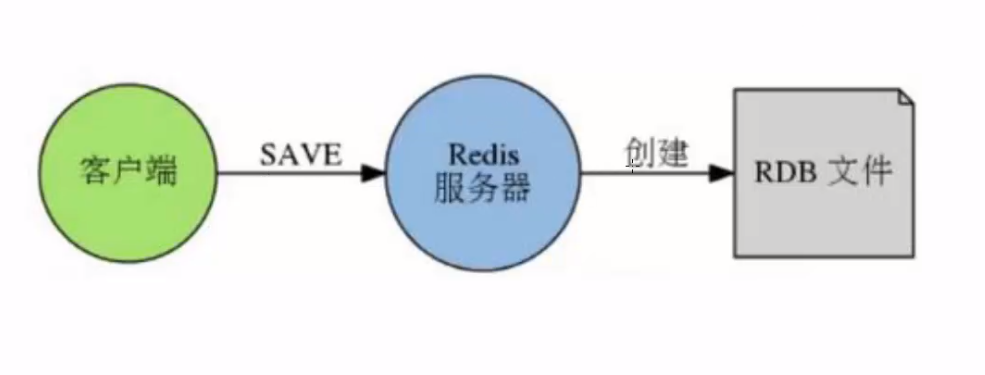
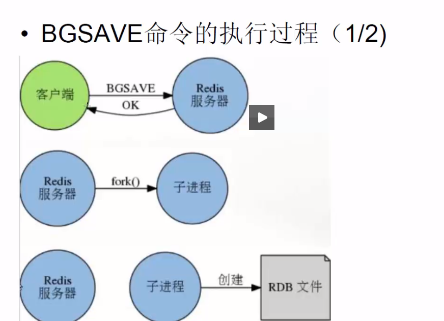
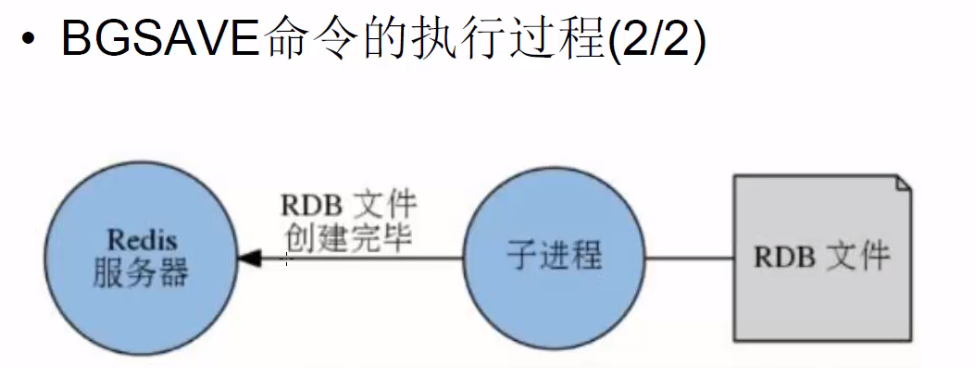
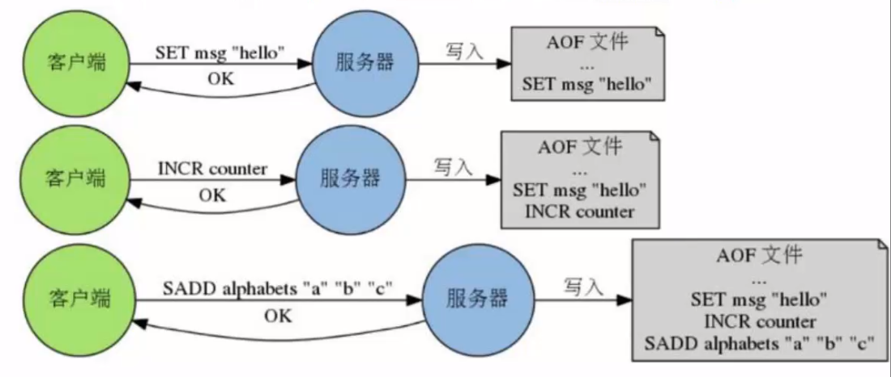
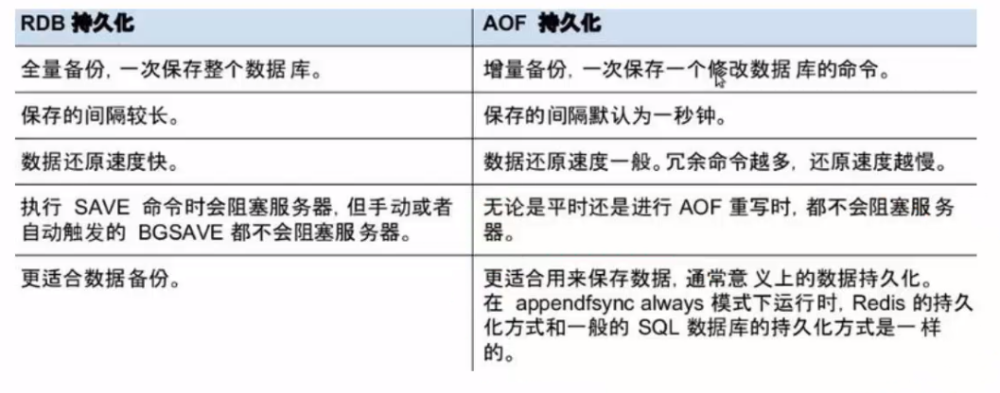

# Redis持久化
## 在redis服务器创建RDB文件的情况下，一下三种最常见的：
- 服务器执行客户端发送的SAVE命令：
- 服务器执行客户端发送的BGSAVE命令：
- 使用save配置选项设置的自动保存条件被满足，服务器自动执行BGSAVE

这三种创建RDB文件的情况中，前两种需要用户手动执行，而第三种情况则是由redis服务器自动执行。

### 手动创建RDB文件，也就是手动发送SAVE命令或者BGSAVE命令
- 通过使用客户端向服务器发送SAVE命令，可以命令服务器去创建一个新的RDB文件：
- redis > save
- 在执行SAVE命令的过程中（也就是创建RDB文件的过程中），redis服务器将被阻塞，无法处理客户端发送的命令请求，只有save命令执行完毕之后（也即是RDB文件创建完毕之后），服务器才会重新开始处理客户端发送的命令请求。
- 如果RDB文件已经存在，那么服务器将自动使用新的RDB文件去代替旧的RDB文件。

### 执行BGSAVE命令同样可以创建一个新的RDB文件
这个命令和SAVE命令的区别在于，BGSAVE不会造成redis服务器的阻塞，在执行BGSAVE命令的过程中，redis服务器仍然可以正常的处理其他客户端发送的命令请求。
BGSAVE命令不会造成服务器阻塞的原因在于：
- 当redis服务器接收到BGSAVE命令时，它不会自己来创建RDB文件，而是通过fork()来生成一个子线程，然后由子线程负责创建新的RDB文件，而自己则继续处理客户端发送过来的命令请求。
- 当子线程创建好RDB文件并退出时，他会向父线程（也就是醋则处理命令请求的redis服务器）发送一个信号，告知它RDB文件已经被创建完成了。
- 最后redis服务器（父线程）接手子线程创建的RDB文件，到此BGSAVE命令执行完毕。

### 自动创建RDB文件
举个例子
#### save 300 10
表示  - 如果距离上一次创建RDB文件已经过去了300秒，并且服务器所有数据库总共已经发生了不少于10次修改，那么执行BGSAVE命令。

#### save 60 10000
表示  - 如果距离上一次创建RDB文件已经过去了60秒，并且服务器所有数据总共发生不少于10000次的修改，则执行BGSAVE命令。

另外用户可以通过设置多个save选项来设置多个自动保存条件，当任意一个条件被满足时，服务器就会自动执行BGSAVE命令。

#### 服务器默认情况
- save 900 1
- save 300 10
- save 60 10000

只要三个条件任意一个被满足时候，服务器就会执行BGSAVE。
每次创建RDB文件之后，服务器为实现自动持久化而设置的时间计数器和次数计数器就会被清零。并重新开始计数，所以多个保存条件的效果是不会叠加的。

## RDB总结
- redis提供RDB持久化和AOF持久化这两种持久化功能。用于将储存在内存里面的数据库数据以文件形式保存到硬盘里面，以免数据因为服务器关闭而丢失。

- RDB文件是一个二进制文件，他保存了redis服务器在创建RDB文件时，所有数据库的数据。

- 三种最常见的创建RDB文件方法是：
  - 执行SAVE命令
  - 执行BGSAVE命令
  - 使用SAVE选项设置保存条件，让服务器自动执行BGSAVE

- 服务器在执行SAVE命令时会阻塞，导致无法处理客户端发出的命令请求。

## RDB持久化的一个缺点
因为创建RDB文件需要将服务器所有的数据库都保存起来，这是一个非常耗费资源和时间的操作所以服务器需要隔一段时间才创建一个新的RDB文件，也即是说，创建RDB文件的操作不能执行得过于频繁，否则就会严重影响服务器性能。

# AOF持久化运作原理
- AOF持久化保存数据库的方法是：每当有修改的数据库的命令被执行时，服务器就会将执行的命令写入到AOF文件的末尾。
- 因为AOF文件里面储存了服务器执行过的所有数据库修改的命令，所以给定一个AOF文件，服务器只要重新执行一遍AOF文件里面包含的所有命令，就可以达到还原数据库的目的。

## 安全性问题
- 虽然数据库执行一个修改数据库的命令，就会把执行的命令写入AOF命令中，但这并不意味着AOF文件持久化不会丢失任何数据。
- 在目前常见的操作系统中，执行系统调用write函数，将一些内容写入到某个文件里面时，为了提高效率，系统通常不会直接将内容写入到硬盘里面，而是先将内容放入一个内存缓冲区（buffer）里面，等到缓冲区被填满，或者用户执行fsync调用和fdatasync调用时才将储存在缓冲区里的内容真正的写入到硬盘里。

- 对于AOF持久化来说，当一条命令真正的被写入到硬盘里面时，这条命令才不会因为停机而意外丢失。
- 因此，AOF持久化在遭遇停机时丢失命令的数量，取决于命令被写入到硬盘的时间。
  - 越早将命令写入到硬盘，发生意外停机时丢失的数据就越少。
  - 越迟将命令写入到硬盘，发生意外停机时丢失的数据就越多。

为了控制redis服务器在遇到意外停机的所丢失的数据量
redis为AOF持久化提供了appendfsync选项，这个选项的值可以是 "always"、"everysec"、"no"
- always 服务器每写入一个命令，就调用一次fdatasync，将缓冲区里面的命令写入到键盘里面，在这种模式下，服务器即使意外停机，也不会丢失任何已经成功执行的的命令数据。
- everysec 服务器每一秒就调用一次fdatasync，将缓冲区里面的数据写入硬盘里面去，这种模式下即使服务器意外停机，最多只会丢失一秒的数据。
- no 服务器不主动调用fdatasync，由操作系统决定任何将缓冲区里面的命令写入到硬盘里面。在这种模式下，服务器遭遇意外停机时，丢失命令的数量是不确定的。

- 运行速度： always速度慢，everysec 和 no 都很快
- 系统默认值是 everysec

## AOF文件中的冗余命令
随着服务器的不断运行，为了记录数据库的不断变化，服务器会将越来越多的命令写入到AOF文件中，使得AOF的体积不断的增大。
为了让AOF文件的大小控制在合理的范围，避免它胡乱增长，redis提供了AOF重写功能，通过这个功能，服务器可以产生一个新的AOF文件。
- 新的AOF文件记录的数据库数据和原有的AOF文件记录的数据库数据完全一样
- 新的AOF文件会使用尽可能少的命令来记录数据库数据，因此新的AOF文件体积通常会比原油的AOF文件的体积要小得多。
- AOF重写期间，服务器不会被阻塞，可以正常的处理客户端发送的命令请求

