# Redis学习笔记
　　我们可以使用redis来缓存一些经常会被用到，或者需要耗费大量资源的内容，通过将这些内容放到redis里面，就是内存里面，程序可以以极快的速度取得这些内容。
　　举个例子，对于一个网站来说，如果某个页面经常会被访问到，或者创建页面时消耗的资源比较多，比如需要多次访问数据库、生成时间较长，等等，那么我们可以使用redis将这个页面缓存起来，减轻网站的负担，降低网站的延迟
## Redis服务安装与设置
#### redis下载地址
http://redis.io/download

## Redis数据类型指令
### 键key
Redis key 值是二进制安全的，这意味着可以用任务二进制序列作为key值，从形如“foo”的简单字符串到一个JPEG文件的内容都可以。空字符串也是有效key值
key 取值原则
- 键值不需要太长，消耗内存，切在数据中查找这类键值的计算成本高
- 键值不宜过短，可读性较差

### 字符串数据类型
Redis中最简单的数据结构，它既可以存储文字，helloword，又可以存储数字，10086，和浮点数3.14，还可以进行二进制的存储10010100
一个字符串类型的值最多可以存储512M字节的内容
Redis为这几种类型的值分别设置了相应的操作命令，让用户可以针对不同的值做不同的处理。

- SET key value
将字符串键 key 的值设置为value，命令返回ok表示设置成功，返回nil表示失败
如果字符串键key已经存在，那么用新值覆盖旧值
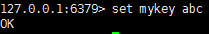
  - set msg "this will fail" XX 若msg键不存在则不能设置
  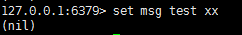
  - set msg "this will seccess" NX 键不存在的时候才能进行设置，简单来说就是不允许覆盖
  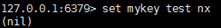

- GET key
获取特定key的值
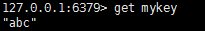 ---------  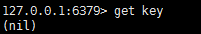获得为空的值

- MSET  MGET  同时设置多个值，同时获取多个值
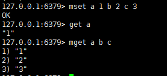

- GETSET  key new-value
它可以将字符串键的值设置为new-value，并返回字符串键设置新值之前的储存的旧值
主要用来减少网络传输次数
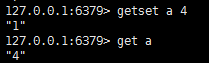

- APPEND key value
将值value插入到字符串键key已存储内容的末尾。
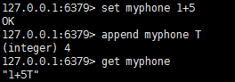

- STRLEN key
返回一个字符串的长度

### 索引
　　字符串的索引以0为开始，从字符串的开头向字符串的结尾一次递增，字符串第一个字符的索引为0，字符串最后一个字符的索引为N-1，其中N为字符串的长度。
　　举个列子，这里有个字符串值叫，‘hello’有5个字符组成，它的索引分别是0、1、2、3、4，从0至4，除了正数索引之外，字符串还有负数索引：负数索引以-1开始，从字符串的结尾向字符串的开头一次递减，字符串的最后一个字符的索引为-N，其中N为字符串的长度　　

### 范围设置
　　因为有了索引，两个字符直接就会有个范围，譬如刚我们说到的0到3，这个就是索引的范围，这就对应着h,e,l,l这四个字符，负数索引是从-3到-1，涵盖了l,l,o这三个字符
　　通过SETRANGE命令我们可以从索引index开始，用你想写入的value值替换掉给定键key所存储的字符串中的部分，等于做手术般的切开病人的胳膊，我们再接上新的胳膊一样。当然这里只接受正索引。
　　命令返回替换之后的字符串值得长度，我们看一个例子，我们将key为msg的值设为“hello”，然后调用SETRANGE命令，然后键为msg，给定的索引为1，也就是字符串的第二个字符开始，也就是从第二个开始我们把字符逐个改写成a,p,p,y，也就是改成了happy，我们现在再用GET msg就会返回happy。
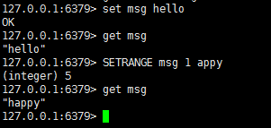
### keys *
可以查看所有已经设置的键
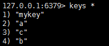

### 数字操作
刚才我们提到，redis字符串键是可以存储数字的，并且当储存的是数字的时候，redis有一些命令可以专门处理这种数字的值，只要存储在字符串键里面的值可以被解释为64位整数，或者标准的64位浮点数，那么用户就可以对这个字符串键执行针对数字值的命令。
下面列出了一些值表格说明他们能否被解释为整数或者浮点数，科学计数法不会视图解释，直接当成字符串了。
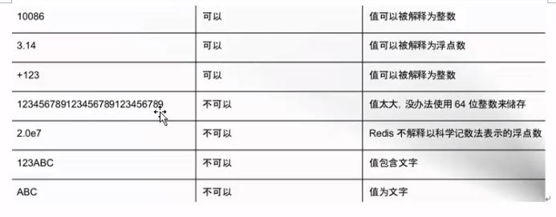

### 列表操作
- 基于Linked List实现
- 元素是字符串类型
- 列表头尾增删快，中间增删慢
- 增删元素是常态
- 最多包含2^32-1个元素
- 列表的索引
  - 从左至右是从0开始的
  - 从右至左是从-1开始的
  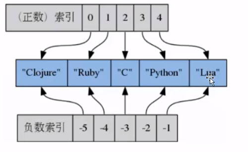
#### 命令说明
- B block块，阻塞
- L left 左
- R right 右
- X exist 存在

#### 左右或者头尾压入元素
- LPUSH key value[value...]  从左边压入元素
- LPUSHX key value
- RPUSH key value[value...]  从右边压入元素
- RPUSHX key value

#### 左右或者头尾弹出元素
- LPOP key   从头部 也就是左端弹出元素
- RPOP key   从尾部 也就是右端弹出元素

#### 从一个列表尾部弹出元素压入到另一个列表头部
- RPOPLPUSH source destination

#### 返回列表中指定范围元素
- LRANGE key start stop
- LRANGE key 0 -1 表示返回所有元素

#### 获取指定位置的元素
- LINDEX key index

#### 设定指定位置元素的值
- LSET key index value

#### 列表长度，元素个数
- LLEN key

#### 从列表头部开始删除值等于value的元素count次
- LREM key count value
- count > 0 ：从表头开始向表尾搜索，移除与value相等的元素，数量为count
- count < 0 ：从表尾开始向表头搜索，移除与value相等的元素，数量为count的绝对值
- count = 0 ：移除表中所有与value相等的值

#### 去除指定范围外元素
- LTRIM key start stop
key 本身不会被移除元素，LTRIM返回的是一个新的元素

#### 在列表中某个存在的值（pivot）前或者后插入元素
- LINSERT key BEFOR|AFTER pivot value
- 如果 key和pivot不存在，则不进行任何操作，返回-1

### 哈希散列 （哈希Map）
- 由field和关联的value组成的Map键值对
- field和value是字符串类型
- 一个hash中最多包含2^32-1键值对
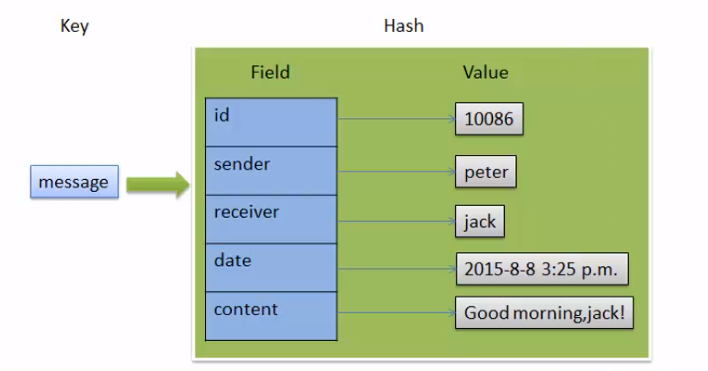

#### Hash用途
- 节约内存空间
- 每创建一个键，它都会为这个键创建并存储一些附加的信息（比如这个键的类型，这个键的最后一次访问时间等等）
- 所以数据库里面的键越多，redis数据库服务器在储存附加管理信息方面耗费的内存就越多，花在管理数据库键上的CPU也会越多在字段对应的值上进行浮点数的增量计算。

#### 不适合Hash的情况
- 使用二进制位操作命令：因为Redis目前支持对字符串键进行SETBIT、GETBIT、BITOP等操作，如果你想使用这些操作，那么只能使用字符串键，虽然散列也能保存二进制数据。
- 使用过期键功能：Redis的键过期功能目前只能对键进行过期操作，而不能对散列字段进行过期操作，因此如果你要对键值对数据使用过期操作的话，那么只能把键值储存在字符串里面。

#### 设置某个字段
- HSET key field value
- HSETNX key field value
  - key的filed不存在的情况下执行，key不存在直接创建  key若存在则不执行

- 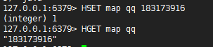

#### 设置多个字段
- HMSET key field value [filed value...]

- 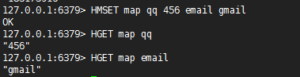

#### 返回字段个数
- HLEN key

#### 判断字段是否存在
- HEXISTS key field
key或者field不存在，则返回0

#### 返回所有键值对
- HGETALL key

- 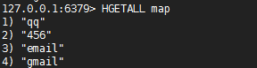

#### 返回所有字段名
- HKEYS key

#### 返回所有value
- HVALS key

#### 在字段对应的值上进行整数的增量计算
- HINCRBY key field increment

#### 在字段对应的值上进行浮点数的增量计算
- HINCRBYFLOAT key field increment

#### 删除指定的字段
- HDEL key field[field...]

### SortedSet有序集合
- 类似Set集合
- 有序的、去重的
- 元素是字符串类型
- 每一个元素都关联着一个浮点数分值（Score），并按照分值从小到大的顺序排列集合中的元素，分值可以相同
- 最多包含 2^32-1 个元素

#### 新增有序集合元素
- ZADD key score member[score memeber ...]  其中score是分值  member是value
- 如果元素已经存在，则使用新的score

- 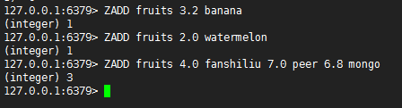

#### 移除一个或者多个元素
- ZREM key memeber[member...]
- 元素如果不存在，则自动忽略

#### 显示分值
- ZSCORE key member

- 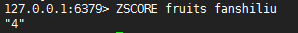

#### 增加或者减少分值
- ZINCRBY key increment member
- increment 为负数就是减少

- 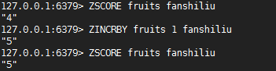

#### 返回元素的排名（索引）  小到大
- ZRANK key member

#### 返回元素的逆序排名  大到小
- ZREVRANK key member

#### 返回指定索引区间元素
- ZRANGE key start stop [WITHSCORES] withscores是否显示分值，可填可不填
- 若果score相同，则按照字典rexicographical order 排列
- 默认按照score从小到大，如果需要score从大到小排列，使用ZREVRANGE

- 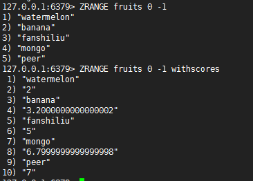

#### 返回指定分值区间元素
- ZRANGEBYSCORE key min max [WITHSCORES] [LIMIT offset count]
- 返回score默认属于[min,max]之间，元素按照score升序排列，score相同字典序
- LIMIT中offset代表跳过多少个元素，count是返回几个。类似于mysql
- 使用小括号，修改区间为开区间，例如(5,(10,5))
- -inf和+inf表示负无穷和正无穷

- 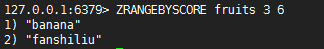

#### 返回集合中元素个数
- ZCARD key
- ZCOUNT key min max 返回指定返回内有多少个元素 时间复杂度为O(n)

## 命令
Redis可以给key设置一个生存时间（秒或毫秒），当达到这个时长后，这些键将会被自动删除。

#### 设置多少秒或者毫秒后过期
- EXPIRE key seconds         设置秒级别过期
- PEXPIRE key milliseconds   设置毫秒级别过期

#### 设置在Unix时间戳过期
- EXPIREAT key timestamp
- PEXPIREAT key milliseconds-timestamp

#### 删除过期
- PERSIST key

#### 生存时间
- Time To Live   key的剩余生存时间

#### 查看剩余生存时间
- TTL key     剩下多长存活时间
- PTTL key
- key 存在但没有设置过期时间 则返回-1
- key 存在，但还在生存周期内，返回剩余的秒或者毫秒
- key 曾经存在，但已消亡，返回-2 （2.8版本之前返回-1）

#### 键类型
- TYPE key

#### 键是否存在
- EXISTS key

#### 键重命名
- RENAME key newkey
- RENAMENX key newkey  键不存在才能重命名

#### 键删除
- DEL key[key...]
