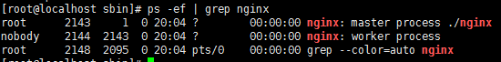

# Centos7 安装 nginx    

## 一、背景  

&emsp;最近在做一个图片服务器，需要用到nginx做图片压缩与下载，所以记录一下完整过程  

&emsp;这是第一篇 `nginx`的安装  

## 二、基本概念以及应用场景  

* 1.什么是nginx  

  &emsp;Nginx是一款使用C语言开发的高性能的http 服务器/反向代理服务器及电子邮件（IMAP/POP3）代理服务器。由俄罗斯的程序设计师Igor Sysoev所开发，官方测试nginx能够支支撑5万并发链接，并且cpu、内存等资源消耗却非常低，运行非常稳定。  

* 2.Nginx的应用场景  

  &emsp;1).http服务器。Nginx是一个http服务可以独立提供http服务。可以做网页静态服务器。

  &emsp;2).虚拟主机。可以实现在一台服务器虚拟出多个网站。例如个人网站使用的虚拟主机。

  &emsp;3).反向代理，负载均衡。当网站的访问量达到一定程度后，单台服务器不能满足用户的请求时，需要用多台服务器集群可以使用nginx做反向代理。并且多台服务器可以平均分担负载，不会因为某台服务器负载高宕机而某台服务器闲置的情况。  

## 三、安装步骤  

### 一、检查并安装所依赖软件  

 * gcc -> `nginx`编译依赖`gcc`环境  

   > **安装命令：yum install gcc-c++**

 * pcre -> (`Perl Compatible Regular Expressions`)是一个`Perl`库，包括 `perl `兼容的正则表达式库。`nginx`的`http`模块使用`pcre`来解析正则表达式.

   > **安装命令：yum install -y pcre pcre-devel**   

 * zlib -> 该库提供了很多种压缩和解压缩的方式，`nginx`使用`zlib`对`http`包的内容进行`gzip`。

   > **安装命令：yum install -y zlib zlib-devel**

 * openssl  -> 一个强大的安全套接字层密码库，囊括主要的密码算法、常用的密钥和证书封装管理功能及`SSL`协议，并提供丰富的应用程序供测试或其它目的使用。`nginx`不仅支持http协议，还支持`https`（即在`ssl`协议上传输`http`）.   

   > **安装命令：yum install -y openssl openssl-devel**  


### 二、下载nginx包    

>**下载命令：wget http://nginx.org/download/nginx-1.12.0.tar.gz**

注意，链接可能失效，提示链接失效的话可以去官网查  


### 三、解压缩源码包并进入  

* 解压  

  > **tar -zxvf nginx-1.12.0.tar.gz**   

* 进入文件夹  

  > **cd nginx-1.12.0**   

### 四、配置编译参数命令（可以使用./configure --help查询具体参数）

在编译安装之前，因为我这里的参数新建了几个文件夹，所以要先手动创建这几个文件夹  

```  
mkdir /var/temp /var/temp/nginx /var/run/nginx
```

创建好文件夹后编译  

```
./configure \
--prefix=/usr/local/nginx \
--pid-path=/var/run/nginx/nginx.pid \
--lock-path=/var/lock/nginx.lock \
--error-log-path=/var/log/nginx/error.log \
--http-log-path=/var/log/nginx/access.log \
--with-http_gzip_static_module \
--http-client-body-temp-path=/var/temp/nginx/client \
--http-proxy-temp-path=/var/temp/nginx/proxy \
--http-fastcgi-temp-path=/var/temp/nginx/fastcgi \
--http-uwsgi-temp-path=/var/temp/nginx/uwsgi \
--http-scgi-temp-path=/var/temp/nginx/scgi
```


### 五、编译并安装  

	>命令：make && make install  

可以进入/usr/local/nginx查看文件是否存在conf、sbin、html文件夹，若存在则安装成功   


## 四、基本使用    

### 1、启动nginx  

- 进入安装目录  `cd /usr/local/nginx/sbin`  

- 启动`nginx`   `./nginx`    

- 若报错：`[emerg] open() "/var/run/nginx/nginx.pid" failed (2: No such file or directory) `  

  需要查看下是不是在/var/run文件夹下不存在nginx文件夹，不存在则新建   

- 查看是否启动：`ps -ef | grep nginx `  

  如果有master和worker两个进程证明启动成功   

  

  注意：执行`./nginx`启动`nginx`，这里可以`-c`指定加载的`nginx`配置文件，如下：

  `./nginx -c /usr/local/nginx/conf/nginx.conf`

  如果不指定`-c`，`nginx`在启动时默认加载`conf/nginx.conf`文件，此文件的地址也可以在编译安装`nginx`时指定`./configure`的参数`(--conf-path= 指向配置文件（nginx.conf）`)  


### 2、停止nginx  

- 暴力 kill (不推荐使用)  
  `kill -9 processId`  

- 快速停止  
  `cd /usr/local/nginx/sbin && ./nginx -s stop`  
  此方式相当于先查出nginx进程id再使用kill命令强制杀掉进程  

- 完整停止(建议使用)  
  `cd /usr/local/nginx/sbin && ./nginx -s quit`  
  此方式停止步骤是待nginx进程处理任务完毕进行停止  

### 3、重启及重新加载配置  

- 1、先停止再启动（建议使用）  
  `./nginx -s quit && ./nginx`  

- 2、重新加载配置文件  
  `./nginx -s reload`  

### 4、测试`nginx`是否安装成功  
`nginx` 安装成功后，默认端口是80，这时候打开浏览器访问ip，若出现`Welcome to nginx`则表示安装成功


　
