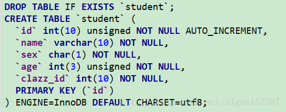
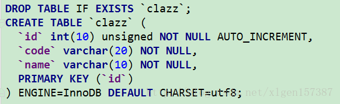
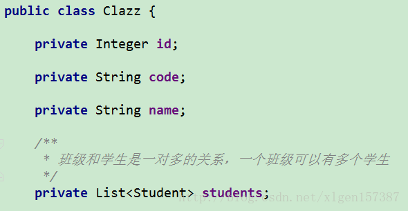
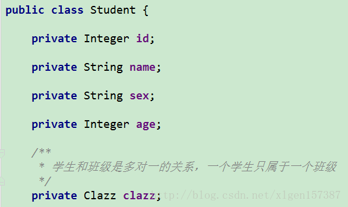
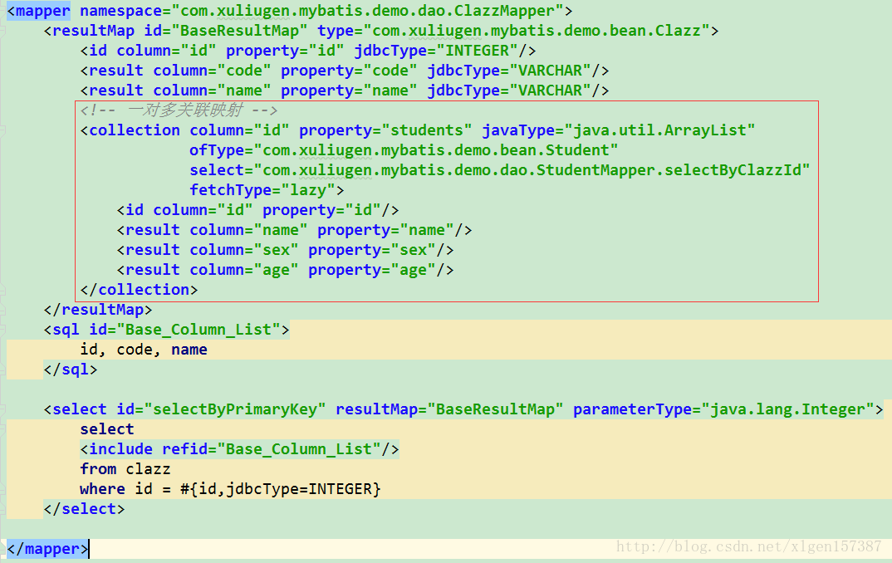
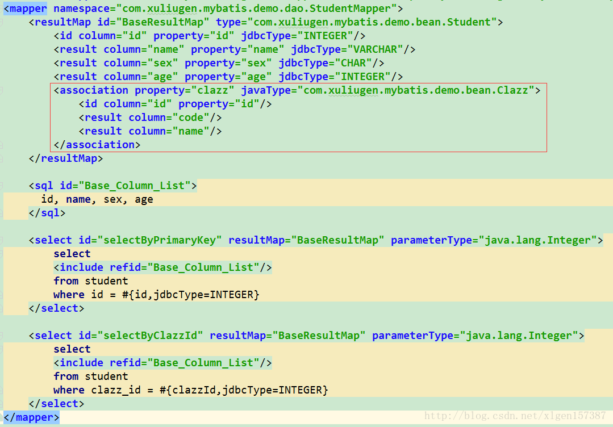
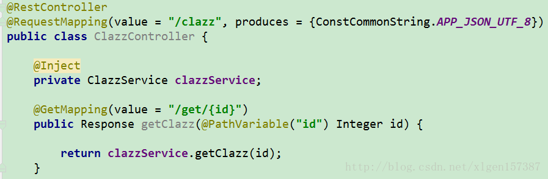
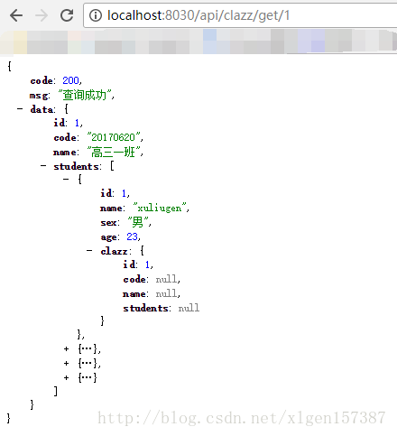

# 记学习中踩到的一个坑。Mybatis一对多关系映射
场景：生活中每一个班级有多个学生，这是最简单的一对多的关系。

## 学生表

其中，`clazz_id` 表示班级ID。

## 班级表

## 班级实体对象

## 学生实体对象

## 班级表XML映射文件

### 重点！！
- 1、fetchType 表示是否是懒加载，可以选择eager和lazy，正常情况下，一对多关联的结合对象，都设置为懒加载lazy；
- 2、property 表示User实体对象中的属性card；
- 3、select 表示根据column数据库属性的值作为该方法的参数；
- 4、javaType表示返回的对象类型；

## 学生表XML映射文件

## 测试Controller

## 测试结果

## 转载自http://blog.csdn.net/xlgen157387/article/details/73507561
