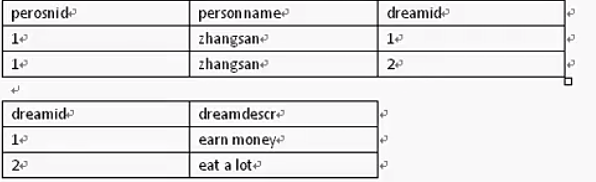

# Hibernate 关联设置
主要是利用`Annotation`进行设置
## 一对一
* 一对一外键关联
主要看代码吧。没啥说的
* 一对一主键关联
主要看代码吧。没啥说的
`@PrimaryKeyJoinColumn`
* 一对一双向外键关联
如果在PO类中都设置`OneToOne`,而且没有设置`mappedBy`属性，则会在两张表中都生成一个外键，这样就会显得很奇怪。
```java
  @Entity
  public class Husband{
    @Id
    @GeneratedValue(strategy = GenerationType.SEQUENCE)
    private int id;
    private String name;
    @OneToOne
    @JoinColumn(name = "wifeId")
    private Wife wife;
    省略set,get方法....
  }
  @Entity
  class Wife{
    @Id
    @GeneratedValue(strategy = GenerationType.SEQUENCE)
    private int id;
    private String name;
    // @OneToOne //这里没有指定mappedBy属性，则生成的两张表都会产生一个外键
    // 实际上我们只需要其中一张表有外键就行了
    // 这里的意思是告诉hibernate 我就是映射到Husband里面的Wife，就是一个OneToOne关系 这样子在Wife表中就不会出现外键了
    @OneToOne(mappedBy = "wife")
    private Husband husband;
    省略set,get方法....
  }
```
凡是双向关联，必设 `mappedBy` 。关系由对方主导
## 组件映射
重写上面的例子
```java
  @Entity
  public class Husband{
    @Id
    @GeneratedValue(strategy = GenerationType.SEQUENCE)
    private int id;
    private String name;
    @Embedded // 组合
    private Wife wife;
    省略set,get方法....
  }
  在Wife类中把所有注解都删了，注意要修改`name`的名称，因为和Husband中重名了
```

## 一对多Or多对一
* 多对一单向关联
    - 数据库表设计：在多方加外键；
    - 错误做法，在一的一方加外键，会造成冗余
    
    由图可以看出 在`person`表中 `person`字段就造成了冗余。
    - 在多的一方创建单的一方的映射 加入注解 `@ManyToOne`。


* 一对多单向关联
  - 类：在一的一方存多方的集合
  - annotation：`OneToMany` 记得加上 `@JoinColumn`不然的话它会处理成多对多的一种特殊情况生成第三张表关联起来。
  - xml:
    ```xml
      <set name="user">
        <key column="groupId"/>
        <one-to-many class="......"/>
      </set>
    ```
* 一对多 多对一双向
  - 在多的一方加入 `@ManyToOne`
  - 在一的一方加入 `@OneToMany` 记得加上`(mappedBy = "***")`属性，表示由多的一方进行维护，因为外键设在了多的一方。


* 多对多单向关联
  - 多对多关联是会生成第三张表的。第三张表的名字为两张表的联合名加下划线
  - 可以用`@JoinTable`来进行名称的映射
  ```java
      假定一个get方法
      @ManyToMany
      @JoinTable(name="t_s",// 定义表名
        JoinColumns={@JoinColumn(name="teacher_id")}// 定义当前po在第三张表中的映射名
        inverseJoinColumns={@JoinColumn(name="student_id")}// 定义当前po对应多对多的表在数据库中的映射名
      )
      public Set<student> getStudent(){
        return students;
      }
  ```
  如果上面不适用`@JoinTable`注解，自动生成的第三张表就会是`Table_Student`,里面的键就是`teacher_id`和<font color = red>`students_id`</font>这个是`set`集合的属性名。
  * xml:
  ```xml
  <set name="students" name="t_s">
    <!-- 对应当前表的id -->
    <key column="teacher_id"/>
    <many-to-many class="......" column="student_id"/>
  </set>
  ```
* 多对多双向
  - 看代码吧少年，没啥好说的。

## 关联关系中的CRUD
### 注解`@Cascade`的作用
在一对多，多对一，或者多对多关系中，如果有这么一个关系
> 类A -> 类B -> 类C  他们之间都是一对多关系，A包含了多个B，B包含了多个C

那么我们要进行存储的时候,如果没有加`@Cascade`注解，我们要讲三个对象都进行存储，即
```java
  Session session = sessionFactory.getCurrentSession();
  session.beginTransaction();
  session.save(A);
  session.save(B);
  session.save(C);
  session.getTransaction().commit();
```
那么当我们对其中一个对象没有进行存储时，它就会报异常，提示说在Transient状态中有对象没有进行持久化。
注解的用法：
```java
  @OneToMany
  @Cascade(value = CascadeType.ALL)

  session.save(A);
```
其`value`的值`ALL`代表同步所有类。
### 铁律
* 双向关系在程序中要设定双向关联，
* 双向必须设置`mappedBy`

### 在一对多关系中读取
假设现在有两个实体关系。一个`Group`，一个`User`，在`Group`类中有一个`Set`集合存储了若干个`User`，这时候存储，从上面可知道，要加上`@Cascade`才会进行联结存储。那么我们读取的时候呢？
```java
  Group g2 = session.get(Group.class,1);
  session.getTransaction().commit();
```
我们都知道，使用`get()`方法会马上发出`sql`语句，然后我们关闭了`session`，我们来看看它发出的`sql`语句是什么
```java
  Hibernate: select group0_.id as id1_0_0_, group0_.name as
   name2_0_0_ from t_group group0_ where group0_.id=?
```
可以看出，就算它有多个`User`的`Set`集合，它也不会去查询`user`表，**不过！！！**当我们在`session`还没有关闭的时候对`Group`对象进行去`user`操作，这时候又会发生什么？
```java
  Group g2 = session.get(Group.class,1);
  User u1 = g2.getUsers().iterator().next();
  session.getTransaction().commit();


  Hibernate: select group0_.id as id1_0_0_, group0_.name as
   name2_0_0_ from t_group group0_ where group0_.id=?
  Hibernate: select users0_.group_id as
   group_id3_1_0_, users0_.id as id1_1_0_, users0_.id
   as id1_1_1_, users0_.name as
   name2_1_1_ from t_user users0_ where users0_.group_id=?
```
可以看出它马上又发出了一条查询语句，将`Group`中`User`的所有对象都查询了出来，所以在具体使用中要注意！**如果只是单纯的想看一下分组信息，记得不要调用其中任何有关子信息的方法，一般`toString()`方法会调用他们！**
也可以设置`FetchType`属性让执行`get`方法的时候就直接一次性全部加载进来
```java
  @OneToMany(fetch = FetchType.EAGER)//全部加载
  @OneToMany(fetch = FetchType.LAZY)// 只加载一部分
```
### Fetch属性
- 双向连接的时候不要两边都设置为`Eager`(会有多余的查询语句发出)
- 对多方设置`fetch`的时候需谨慎，结合具体应用，一般用`LAZY`，特殊情况(多的一方不多的时候可以考虑，提高效率时候可以考虑)

### 注意事项
- 想要消除关联关系，设设定关系为`null`，再删除对应记录，如果不删除记录，该记录就会变成垃圾数据。
- 如果指定`@OneToOne`的`fetch`属性为`FetchType.LAZY`，会延迟对于关联对象的加载，不管是`load`还是`get`。

### 删除
上面提到了如果涉及到连级关系，而且在`@OneToMany`中设置了`@Cascade(value = CascadeType.ALL)`,那么删除多的一方其中一个数据，会导致关联到其的所有数据都删除。
eg：
```java
  Session session = sessionFactory.getCurrentSession();
  session.beginTransaction();
  User u = (User)session.load(User.class,1);
  session.delete(u);
  session.getTransaction.commit();

  // 这时候你会发现，与ID为1的user对象所关联的Group对象，然后与Group对象关联的其他user对象也一起被删除了。
  // 我们可以这么做

  User u = (User)session.load(User.class,1);
  u.setGroup(null);// 先清除关系
  session.delete(u);
  Or
  // 使用HQL
  session.createQuery("delete from User u where u.id = 1").executeUpdate();
```
## 继承映射(不是很重要)
有三种数据库表的设计
- 定义一个父类，包含所有子类的字段，在父类中有专门一个字段区分是哪个子类的，这样就将所有的信息都存储在同一张表中，会造成大量的冗余。
- 每一个子类一张表。
- 利用`JOIN`关系联结。

具体的用法查查文档，这里不深入了解
