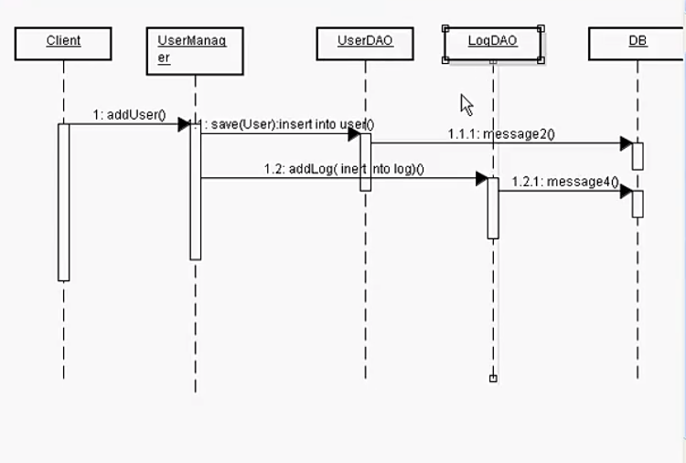
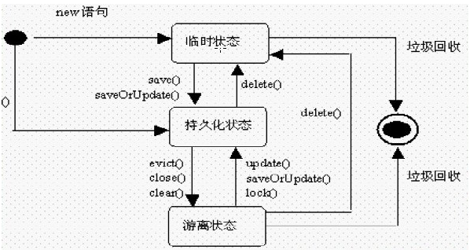

# Hibernate接口介绍
对于这里的接口，并不是我们常说的`Interface`而是一些我们常用的`Hibernate`方法
## Configuration
获取配置文件信息
```java
  Configuration cfg = new Configuration().configure();
```
一般来说，如果没有修改名称，它会自动的去读取`Path`目录下的`hibernate.cfg.xml`文件。如果修改了这个文件的名称，那么`configure()`有一个重载方法
```java
  Configuration cfg = new Configuration().configure("hibernate.xml");
```
## SessionFactory 获取一个Session对象
这个顾名思义，它是一个工厂类，创建的它的方式
```java
  SessionFactory sessionFactory = cfg.buildSessionFactory();
```
一般来说，一个应用程序只存在一个`SessionFactory`除了要连接多个数据库，而且在多个数据库中还需要多个`Configuration`对象，读取不同的配置文件。
### 关注SessionFactory中的两个方法
* `openSession`
  ```java
      Session session = SessionFactory.openSession();
  ```
  这个方法每次都会打开一个新的`Session`，需要人为的手动`Close()`

* `getCurrentSession`
  ```java
      Session session = SessionFactory.getCurrentSession();
  ```
  这个方法首先会在上线文中找，如果有就用旧的，如果没有就创建新的，它会在`session`执行`commit`操作后自动的`close`掉。在一个`session`中，只要没有执行`commit`方法，那么继续调用`getCurrentSession`获取的`session`都属于同一个`session`，如果`commit`了，那么获取的就是一个新的`session`。
  它的上下文在配置文件中是这样的
  ```xml
    <property name="hibernate.current_session_context_class">thread</property>
    经常使用的两个选项
    thread 使用 connection 遇到异常就rollback，只针对一个数据库
    jta 分布式事务，针对多个数据库 java transaction api 具体的请自行学习
  ```
  * 他们的区别用途
  现在一般都是使用`getCurrentSession`，原因是事务好控制，界定事务边界。试想一下，如果一个办公系统，我增加了一个新的员工，那么我要往员工表插入一条数据，同时我还想记录下来今天谁插入了一条员工，那么会往日志表插入一条数据。这样子的话就必须要有事务了，因为可能我插入新员工失败却在日志表中插入成功了，所以对于这个事务的回滚要属于同一个`Session`
  

## Session
[session的三种状态]

三种状态的区分在于
* 实体类中有没有id（适用于自增id字段，人为设置的不算）
* ID在数据库中有没有
* ID在内存中有没有（`Session`缓存中）

三种状态：
* transient(临时): 内存中一个对象，没有`id`，缓存也没有
* persistent(持久化): 内存有，缓存有，数据库也有
* detached(游离)：内存有，缓存没有，数据库有，正是因为缓存没有了才说它游离了

***
* `Session`有一个`Map`，`Map`的`key`对应了自动生成的`id`，`Map`的`value`对应了这个对象的引用，相当于保留了一个缓存
* 如果对象已经被`session`调用`save`方法放进了缓存中，然后这时候再修改对象的值，这时候它会发出一条`update`语句，即在`commit`后，实际上`hibernate`发出了两条语句
  ```java
  session = sessionFactory.openSession();
  session.beginTransaction();
  Teacher teacher = new Teacher();
  teacher.setAge(18);
  teacher.setGender("英语");
  teacher.setName("教师一");
  session.save(teacher);
  System.out.println(teacher.getId());
  System.out.println(teacher.getGender());
  teacher.setGender("语文");
  session.getTransaction().commit();
  ```
  
<font color = "red">各种操作`save`、`delete`的对应操作参考图解</font>;

### 数据库查询
#### Get
直接就向数据库发出查询语句，返回一个对象并装载起来。
#### Load
load返回的是代理的对象，等到真正用到的时候才会发出sql语句。
eg：
```java
@Test
  public void loadDB(){
      Session session = sessionFactory.getCurrentSession();
      session.beginTransaction();
      Teacher t = session.load(Teacher.class,2);
      //System.out.println(t); 当我load后没有执行对象的使用直接commit关闭了session
      session.getTransaction().commit();
      //System.out.println(t.getName());
      // 这时候这里就会报错，因为它load的时候是存在缓存了，是属于一个代理对象，
      // 当session关闭了，这个对象就没了，会报no session异常
      System.out.println(t);
  }
```
注意看里面的文字！

### 数据库更新Update
* 用来更新`detached`对象，更新完成后转为`persistent`状态，相当于先从数据库读取一条数据关闭`commit`后再打开一个新的`session`重新更新它。
* 更新`transient`对象会报错。如果该对象为自己新建，而数据库的`ID`采用自增，则此时就会报错。
* 更新自己设定`id`的`transient`对象可以(数据库有对应记录)
* 更新部分更改字段：
  - `xml`设定`property`标签的`update`属性，`annotation`设定`@Column`的`updatable`属性。这种方法少用，不灵活。
  - 使用`xml`中的`dynamic-update`,JPA1.0中 `Annotation`没有对应的属性。对于同一个`session`可以，跨`session`不行，不过可以使用`merge()`，一样耗费时间，`merge()`会先执行一遍`select`语句再进行对比更新
  - 使用`HQL` (建议)

### 清除缓存 clear()
无论是`load`还是`get`，都会先查找缓存(一级缓存)，如果没有，才会去数据库查找，调用`clear()`方法可以强制清除缓存。

### 同步 flush()
强制让`session`缓存与数据库进行同步，在`commit`之前会默认进行`flush()`

### 自动建表
`hibernate`除了可以在配置文件中利用`xml`定义建表外
```xml
  <property name="hbm2ddl.auto">create</property>
```
还可以使用
```java
  StandardServiceRegistry serviceRegistry = new StandardServiceRegistryBuilder().configure("hibernate/hibernateLearn.cfg.xml").build();
  Metadata metadata = new MetadataSources(serviceRegistry).buildMetadata();
  SchemaExport schemaExport = new SchemaExport();
  schemaExport.create(EnumSet.of(TargetType.DATABASE), metadata);
```
这种方法可以用来看一下建表的`SQL`是怎么样的。
