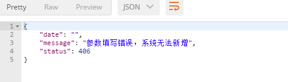

# Jersey 捕获自定义异常    

## 背景  

大家都知道`Spring`可以自定义切面做异常控制，在看了一些资料后发现Jersey也有类似的功能，且不用整合`Spring`  

在代码中异常控制，可以大量减少`try/catch`的使用，也不需要将异常从`Dao`层一直往`Controller`层往上抛。  

先来介绍一下异常分类：  

### **Throwable类**   

Throwable类是所有异常的始祖，它有两个直接子类Error / Exception：  Error仅在Java虚拟机中发生动态连接失败或其它的定位失败的时候抛出一个Error对象。一般程序不用捕捉或  抛出Error对象。  

### **Unchecked Exception:**   

* 指的是程序的瑕疵或逻辑错误，并且在运行时无法恢复。   
* 包括Error与RuntimeException及其子类，如：OutOfMemoryError, UndeclaredThrowableException, IllegalArgumentException, IllegalMonitorStateException, NullPointerException, IllegalStateException, IndexOutOfBoundsException等。  
*  语法上不需要声明抛出异常。  

### **Checked Exception:**    

* 代表程序不能直接控制的无效外界情况（如用户输入，数据库问题，网络异常，文件丢失等）

* 除了Error和RuntimeException及其子类之外，如：ClassNotFoundException, NamingException, ServletException, SQLException, IOException等。 

* 需要try catch处理或throws声明抛出异常。  

  

### 除此之外我们来看一下异常处理原则 ：  

- 在框架层面封装checked exception，将其转化为unchecked exception，避免开发过程中编写繁冗的try...catch代码。  
- 业务层面的开发，根据程序代码职责定义不同的RuntimeException(它就是unchecked exception，一般定义为RuntimeException的子类)  
- 通过前两个观点，系统中自定义的异常将只存在unchecked exception，系统只在于客户端交换数据的上层，设置统一异常处理机制，并将一些异常转化为用户所能理解的信息传达给用户。  
- 其他如业务层，数据持久层，等底层只负责将异常抛出即可，但要注意不要丢失掉异常堆栈（这一点是初学者容易犯的一个错误）。  

以上摘自[参考博客](https://blog.csdn.net/u013628152/article/details/42677655)  

## 正题（开始配置）  

`Jersey`自带了一个异常过滤器`ExceptionMapper<Exception>`，我们得先创建一个自定异常管理类去实现它。    


### 创建自定义异常基础类BaseExceptionMapper  

```java
package cn.sibat.bus.emergency.api.mapper;

import javax.ws.rs.core.Response;
import javax.ws.rs.ext.ExceptionMapper;
import cn.sibat.bus.emergency.exception.ServiceException;
import cn.sibat.bus.emergency.util.AjaxResult;
import org.apache.log4j.Logger;
/**
 * @author BF
 *      自定义运行时异常
 */
public class BaseExceptionMapper implements ExceptionMapper<Exception>{
	
	private static Logger log = Logger.getLogger( BaseExceptionMapper.class ); 

	@Override
	public Response toResponse(Exception exception) {
		Response.ResponseBuilder responseBuilder = null;
        // 用户自定义的运行时异常处理
        // ServiceException 是我们自定义的异常
        if (exception instanceof ServiceException) {
            // 获取状态码
            int code = ((ServiceException) exception).getCode();
            // 获取错误信息
            String message = exception.getMessage();
            // AjaxResult是一个响应工具类
            responseBuilder = Response.ok(AjaxResult.customResponse(code,message)).status(
                    ((ServiceException) exception).getCode());
        }
        // 其他异常
        else {
            responseBuilder = Response.ok(AjaxResult.errorResponse(exception.getLocalizedMessage())).status(
                    Response.Status.INTERNAL_SERVER_ERROR);
        }
        // 控制台打印异常信息
        exception.printStackTrace();
        // 异常信息返回
        return responseBuilder.build();
	}
}
```

这个类需要继承`ptionMapper<Exception>` 重写 `toResponse`方法。注意 ，这个类需要放在被`jersey`扫描的包下，也即是通常所说的 `api` 或者`controller`包下。  

这个类主要是用来监控程序运行时所有抛出的异常，在抛出异常时都会经过这里检查再返回。

### 自定义异常 ServiceException  

```java
package cn.sibat.bus.emergency.exception;

/**
 * @author iceflow
 * @date 2018/8/17
 */
public class ServiceException extends RuntimeException  {

    private static final long serialVersionUID = 1L;

    /**
     * 默认为500 服务器出错
     */
    private int code = 500;

    public ServiceException(){

    }

    public ServiceException(int code ,String msg){
        super(msg);
        this.code = code;
    }
    public ServiceException(String msg) {
        super(msg);
    }

    public int getCode() {
        return code;
    }

    public void setCode(int code) {
        this.code = code;
    }
}
```

一个很简单的异常类，继承了`RuntimeException`  

### 具体使用  

来看下面的代码  

```java
public MissionEntity addMission(MissionEntity missionEntity){
        missionEntity.setId(UUID.randomUUID().toString());
        String desc = "接上级通知，请相关部门做好【" + missionEntity.getMissionName() + "】保障工作。";
        // 获取环信生成的群聊组ID
        String easemobId = HttpURLConnectionUtil.GROUPID.getChatgroupsID(missionEntity.getMissionName(),desc,missionEntity.getUserId(),null);
        missionEntity.setEasemobId(easemobId);
        MissionEntity mission = missionDao.addMission(missionEntity);
    	// 这里我们抛出了异常
        if (mission == null){
            throw new ServiceException(406,"参数填写错误，系统无法新增");
        }
        return mission;
    }

```

当系统捕获到`ServiceException`异常的时候，会先跳转到`BaseExceptionMapper`中，进行判断异常类型，最后由`BaseExceptionMapper`将异常结果返回给页面  




