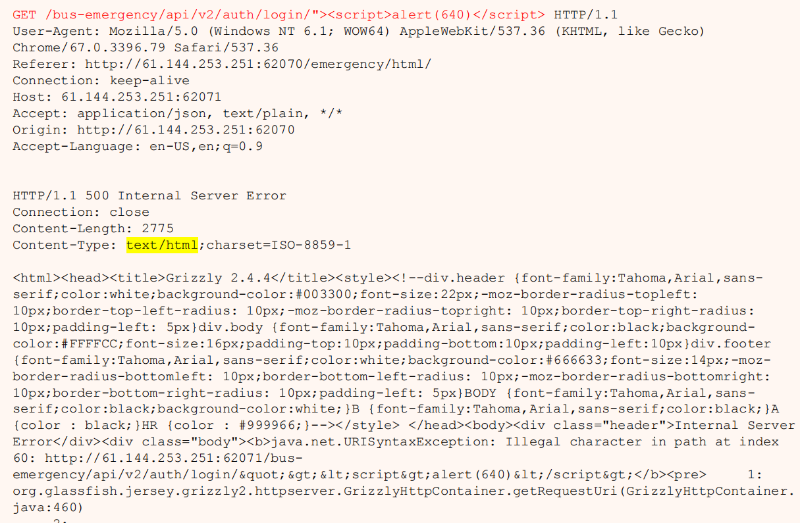
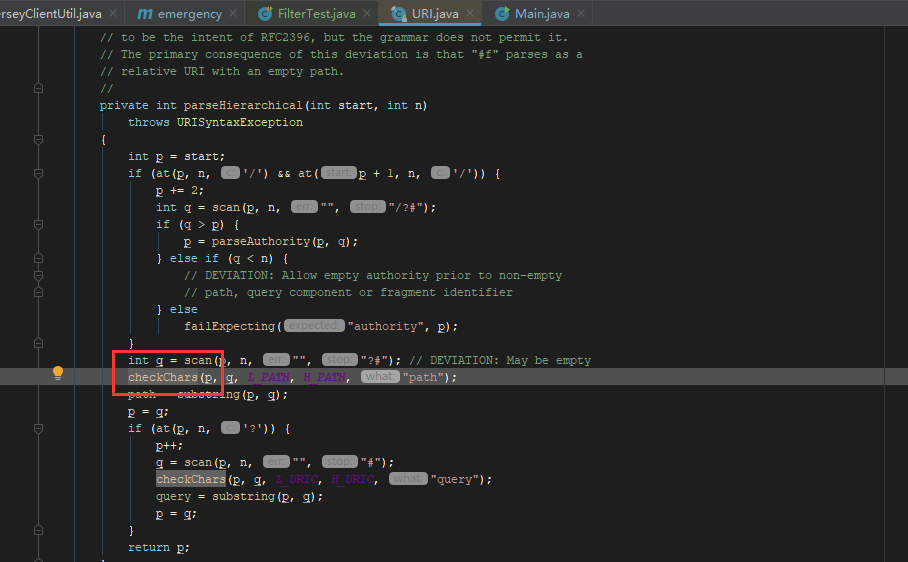
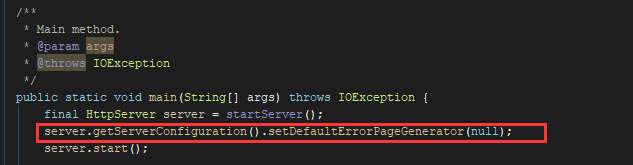

# 关于 Grizzly 请求顺序引发的 XSS 漏洞问题  

> 以下问题均是使用抓包工具测试的，在浏览器中会自动帮你过滤掉特殊字符，所以在浏览器进行 XSS 注入行不通，并不会重现问题。

在做 应急保障 系统安全检测时，发现了一个关于脚本注入的问题一直过不去的问题。  

对应的框架是 `Jersey` + `Grizzly` 启动的，在项目中，过滤器与拦截器都配置，确还是无法通过。具体的错误信息如下：  

有上面错误整体的思考解决方案有两个

* 配置过滤器，将 `url` 中的非法字符拦截掉
* 关闭 `jersey` 的错误页面

## 关于 Jersey 的过滤器拦截器问题

`Jersey` 中，过滤器与拦截器的执行顺序是 `filter -> resource ->Interceptor `  

按理说我们如果配置了字符过滤器，那么在请求资源前就会将非法字符拦截掉，但这个方法没用！对于配置了 `Grizzly` 服务的代码来说并不起作用。  

最后通过 `DEBUG` 发现，在用 `Grizzly` 做启动容器的时候，它内部使用的是 `java.net.uri` 处理请求链接的，而在 `uri` 下，它会自动的处理非法字符，这个时候，请求还没到 `Jersey` 的过滤器就已经被 `Grizzly` 容器给拦了下来，所以无论怎么改你的过滤器都无法解决这个问题。  

  ## 修改默认的错误页面 

上分我们分析了，含有特殊字符的请求在还没到 `Jersey` 层面的时候就已经被 `Grizzly` 给拦截下来了，所以我们配置错误页面的话，也不能针对 `Jersey` 来配置。  

在 `Grizzly` 中，它的默认错误页面是将错误信息打印出来（当然，这一层不会显示在浏览器上，浏览器在发起请求的时候已经帮我们做了字符过滤），通过启动 `HttpService` 的时候可以修改他的默认错误页面  

这里我们将 `Grizzly` 的默认错误页面修改为 `null` 则以上的特殊字符异常的异常信息不会再被抓包抓到，它默认返回了 **Internal Server Error** 就没了。
